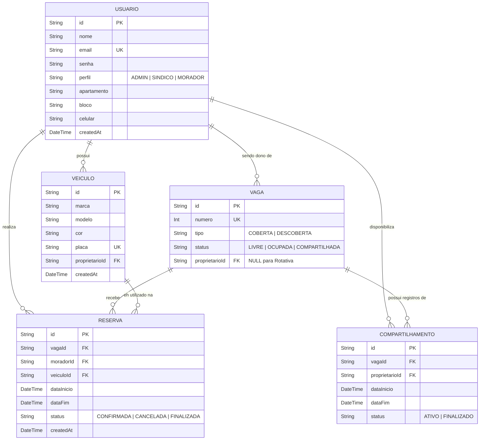

# ⚙️ Etapa 2: APIs, Web Services e Persistência de Dados Distribuída

Este documento serve como diretriz mestre de engenharia e repositório de evidências para a **Etapa 2: Desenvolvimento de APIs, Web Services e Persistência**. Ele foi estruturado para orientar o desenvolvimento prático do backend distribuído e permitir o acompanhamento e auto-gestão das atividades pelos alunos.

---

## 🎯 Rubricas de Avaliação desta Etapa

Ao final desta Etapa, cada aluno será avaliado individualmente nestas 6 competências (incluindo oportunidades de desenvolvimento e reavaliação):

1. **H34a-SI-G: Gerenciar e documentar serviços de TI**: Gerenciar e documentar serviços de TI, de forma clara e objetiva (Reavaliação teórica e prática a partir do gerenciamento de serviços no backend em [src/backend/](src/backend/)).
2. **H35b-SI-G: Planejar, desenvolver e gerenciar uma arquitetura de aplicação distribuída**: Desenvolver uma arquitetura de aplicação distribuída (Medido no código em [src/backend/](src/backend/) e na seção [Modelagem da Aplicação e Arquitetura de Dados](#2-modelagem-da-aplicacao-e-arquitetura-de-dados)).
3. **H35c-SI-G: Planejar, desenvolver e gerenciar uma arquitetura de aplicação distribuída**: Gerenciar uma arquitetura de aplicação distribuída, testando, implantando e avaliando a solução (Medido na seção [Instruções de Implantação e DevOps](#5-instrucoes-de-implantacao-e-devops)).
4. **H36a-SI-G: Planejar, desenvolver e gerenciar APIs e Web Services**: Planejar e documentar APIs e Web Services, de forma clara e objetiva (Medido na seção [Especificação Avançada de Endpoints](#3-especificacao-avancada-de-endpoints) e atualizações no design de contratos).
5. **H36b-SI-G: Planejar, desenvolver e gerenciar APIs e Web Services**: Desenvolver APIs e Web Services (Medido em [src/backend/](src/backend/) e na construção real dos endpoints).
6. **H36c-SI-G: Planejar, desenvolver e gerenciar APIs e Web Services**: Gerenciar APIs e Web Services, testando, implantando e avaliando a solução (Medido na seção [Estratégia e Relatório de Testes Automatizados](#4-estrategia-e-relatorio-de-testes-automatizados)).

---

## 📅 QUADRO DE CONTRIBUIÇÃO REAL (ETAPA 2)

**Atenção alunos:** Preencham esta tabela para atualizar o andamento das tarefas e quem foi o responsável técnico pela construção do backend. Os nomes, usuários e links de evidências devem corresponder aos entregáveis em [src/backend/](src/backend/).

- **Status admitidos**: `⌛ Não Iniciado` | `📝 Em Progresso` | `✔️ Entregue`
- **Autoria Git**: Indica se há commits desse estudante nos arquivos da tarefa.

**Atividades Semanais desta Etapa** (ver [Cronograma do Semestre](contexto.md#-cronograma-do-semestre-semana--periodo)):
- `ATV2.1` — Desenvolvimento de Funcionalidades - API (Semanas 5 a 8)
- `ATV2.2` — Testes - API (Semana 9)

| Rubrica Curricular | ID Tarefa | Atividade Semanal | Descrição Detalhada da Tarefa | Estudante Responsável | GitHub Username | Status de Entrega | Evidência/Seção Temática | Autoria Git |
| :---: | :---: | :---: | :--- | :--- | :---: | :---: | :--- | :---: |
| **H36b** | `T2.1` | `ATV2.1` | Configuração do Boilerplate da API, Roteamento e Inicialização | [Nome do Aluno 1] | `username1` | `⌛ Não Iniciado` | [Instalação/README](src/backend/README.md) | [ ] |
| **H36b** | `T2.2` | `ATV2.1` | Modelagem e Persistência de Dados (Conexão DB, ORM, Schemas) | Andre Lopes | `dezim005` | `✔️ Entregue` | [Seção 2.1](#21-schema-e-diagrama-entidade-relacionamento) | [ ] |
| **H36b** | `T2.3` | `ATV2.1` | Implementação de Endpoints CRUD e Lógica de Negócios Principal | Giovanny Lisboa | `glisboapuc` | `⌛ Não Iniciado` | [Seção 3.0](#3-especificacao-avancada-de-endpoints) | [ ] |
| **H36b** | `T2.4` | `ATV2.1` | Mecanismo de Segurança da API (Autenticação/Autorização JWT) | Gustavo Veloso | `gust_2003` | `⌛ Não Iniciado` | [Seção 3.3](#33-seguranca-e-autorizacao) | [ ] |
| **H35b** | `T2.5` | `ATV2.1` | Gateway, Integração de Serviços Web e Clientes HTTP Externos |Roberta Alves Lima | `RobertaAlvesLima` | `⌛ Não Iniciado` | [Seção 2.2](#22-integracao-e-infraestrutura-distribuida) | [ ] |
| **H36c** | `T2.6` | `ATV2.2` | Desenvolvimento de Testes Automatizados (Unitários/Integração) | Allan Viana | `username6` | `⌛ Não Iniciado` | [Seção 4.0](#4-estrategia-e-relatorio-de-testes-automatizados) | [ ] |
| **H35c** | `T2.7` | `ATV2.1` | Construção de Dockerfile e Configuração de docker-compose | [Nome do Aluno 1] | `username1` | `⌛ Não Iniciado` | [Seção 5.1](#51-conteinerizacao-de-servicos) | [ ] |
| **H36c** | `T2.8` | `ATV2.2` | Proposta de Implantação e Pipeline de CI/CD Backend | [Nome do Aluno 5] | `username5` | `⌛ Não Iniciado` | [Seção 5.2](#52-proposta-de-infraestrutura-de-deploy-e-ambiente-em-producao) | [ ] |

---

# 1. Escopo e Objetivos do Backend

O ecossistema de back-end do VagaLivre constitui o núcleo transacional e a única fonte de verdade da solução distribuída. Ele é responsável por orquestrar de forma centralizada e segura o fluxo de informações consumido pelas duas interfaces clientes: o Painel Administrativo Web (Next.js) e o Aplicativo do Morador (React Native). O principal objetivo técnico do back-end é expor uma API RESTful de alto desempenho, segura e resiliente, capaz de arbitrar o compartilhamento concorrente de recursos físicos escassos (vagas de garagem) sem falhas de integridade ou atrasos operacionais.

## 1.1. Organização em Módulos Lógicos

Para viabilizar uma manutenção sustentável e permitir que diferentes integrantes do grupo programem de forma paralela, a API adota uma arquitetura de monólito modular organizada em três grandes módulos de responsabilidade:

- Módulo de Identidade e Acesso (Identity): Centraliza os processos de segurança da aplicação. É responsável pelo cadastro de usuários, criptografia de senhas, validação de perfis (síndico, portaria e morador) e emissão de tokens de acesso JWT (JSON Web Token) assinados com expiração programada.
- Módulo de Gestão de Vagas e Reservas (Booking & Parking Core): Abriga as regras de negócio mais críticas do sistema. Ele gerencia o ciclo de vida do mapeamento físico das vagas, coordena as solicitações de reservas temporárias, controla o pool de vagas ociosas compartilhadas por moradores e arbitra o acesso concorrente aos dados das vagas físicas.
- Módulo de Tarefas Assíncronas e Mensagens (Notification Queue): Desacoplado do fluxo síncrono principal da API, este módulo é responsável por enfileirar e despachar tarefas que não devem onerar a latência de rede direta da requisição, como o processamento de regras temporais em segundo plano e o disparo de notificações push para os telefones celulares dos moradores.

## 1.2. Justificativa da Pilha de Desenvolvimento

As escolhas das tecnologias de desenvolvimento para o back-end foram planejadas estrategicamente para maximizar a sinergia técnica com o histórico do código pré-existente e garantir robustez sob carga:

- Pilha de Programação: Node.js (TypeScript) utilizando o framework NestJS. O Node.js oferece alta escalabilidade graças ao seu mecanismo de E/S assíncrono e não-bloqueante orientado a eventos (Single-Threaded Event Loop), garantindo que requisições paralelas rápidas (leitura do mapa de vagas) sejam processadas com latência mínima. O NestJS introduz um padrão de organização modular robusto inspirado em Clean Architecture, utilizando inversão de controle e injeção de dependências, o que mitiga o acoplamento de código.
- Gerenciador de Banco de Dados (SGBD): PostgreSQL com a camada de abstração de dados do Prisma ORM. O PostgreSQL foi eleito por seu estrito cumprimento das propriedades ACID (Atomicidade, Consistência, Isolamento e Durabilidade). Em sistemas de reservas de vagas, onde múltiplos usuários podem disputar o mesmo espaço no mesmo segundo, o controle transacional do PostgreSQL impede inconsistências lógicas de persistência concorrente. O Prisma ORM garante a consistência de tipagem de dados de ponta a ponta em TypeScript entre o banco de dados e as rotas da API.
- Armazenamento de Alta Velocidade e Filas: Redis. Atua como banco de dados chave-valor em memória para gerenciar a blacklist de tokens JWT revogados, realizar cache de dados estáticos de baixa mutabilidade e hospedar a infraestrutura de filas distribuídas por meio da biblioteca BullMQ, garantindo que o disparo de e-mails ou alertas móveis não consuma threads de CPU do servidor principal da API REST.

## 1.3. Volumetria e Capacidade Transacional Esperada

O dimensionamento técnico do backend do VagaLivre foi modelado para atender com folga às demandas de um condomínio residencial de médio a grande porte:

- Escopo de Entidades: O banco de dados é projetado para suportar até 1.000 usuários ativos, 1.500 veículos registrados e 500 vagas de garagem simuladas.
- Latência de Resposta: Estabelece-se a meta de tempo de resposta HTTP inferior a 150ms para consultas de leitura (visualizar vagas disponíveis) e inferior a 250ms para solicitações de escrita (realizar uma reserva com lock transacional).
- Tratamento de Concorrência Extrema: A capacidade transacional exige zero anomalias de double-booking em testes de estresse de gravação paralela (múltiplas chamadas de reserva enviadas à mesma vaga no mesmo milissegundo), garantindo que o PostgreSQL aborte as requisições excedentes de forma controlada através de exceções semânticas de concorrência.

---

# 2. Modelagem da Aplicação e Arquitetura de Dados

*(Esta seção atende diretamente à rubrica **H35b**)*

Esta seção detalha a estrutura lógica e física de persistência do ecossistema distribuído do VagaLivre, apresentando a modelagem das entidades, os seus relacionamentos e o plano de infraestrutura para garantir a integridade dos dados e o alto desempenho em cenários de uso concorrente.

## 2.1. Schema e Diagrama Entidade-Relacionamento

Para garantir consistência estática e tipagem forte em todo o fluxo de dados (do banco de dados até as rotas da API), a persistência é gerenciada utilizando o Prisma ORM integrado a um banco de dados relacional PostgreSQL.

**Diagrama Entidade-Relacionamento (DER)**

O relacionamento entre as tabelas do sistema distribuído está mapeado no diagrama abaixo, estruturado para suportar o cadastro de moradores, o controle de seus veículos, o mapeamento físico das vagas e as operações de compartilhamento e reserva.


**Script de Migração Schema (Prisma Schema DDL)**

O código abaixo representa a especificação mestre de modelagem física que gera as tabelas, as chaves primárias (PK), as chaves estrangeiras (FK) e os índices únicos (UK) no PostgreSQL.

O modelo de dados está definido no arquivo [schema.prisma](https://github.com/ICEI-PUC-Minas-PMV-SI/pmv-si-2026-2-pe6-t2-g09/blob/main/src/backend/schema.prisma)

**Script de Sementes do Banco de Dados**

Para viabilizar os testes de integração e garantir que o sistema distribuído possua dados básicos de infraestrutura em sua primeira execução (como a conta do administrador/síndico e o mapeamento inicial das vagas físicas), foi concebido o script de população automatizada de dados no arquivo [seed.ts](https://github.com/ICEI-PUC-Minas-PMV-SI/pmv-si-2026-2-pe6-t2-g09/blob/main/src/backend/seed.ts)

## 2.2. Integração e Infraestrutura Distribuída

O controle e a escalabilidade de uma solução distribuída para condomínios exigem que a arquitetura do backend mitigue gargalos comuns de concorrência física e acessos simultâneos de rede.

### Controle Avançado de Concorrência (Prevenção de Reserva Dupla)
Para impedir que dois moradores reservem a mesma vaga no mesmo intervalo de tempo, o backend utiliza um mecanismo de bloqueio transacional de concorrência.

- Ao receber uma solicitação de agendamento, o NestJS inicia uma transação ACID isolada no PostgreSQL (prisma.$transaction).
- O sistema verifica se existe alguma reserva conflitante para aquela vaga e período usando uma estratégia de bloqueio de linha para escrita (pessimistic lock / SELECT FOR UPDATE).
- Se nenhuma colisão for encontrada, a reserva é persistida e o status da vaga é alterado para OCUPADA (ou RESERVADA), liberando a trava e confirmando a operação de forma segura. Caso contrário, ocorre um rollback automático e a API retorna imediatamente o código de erro 409 Conflict.

### Pool de Conexões com Banco de Dados (Connection Pooling)
Uma das principais causas de lentidão em backend Node.js integrado a bancos relacionais é o esgotamento de conexões disponíveis. Para otimizar o uso de recursos de infraestrutura:

- O backend utiliza o gerenciador de conexões embutido no Prisma Client, configurado com um limite dinâmico de conexões simultâneas (connection_limit=10 por instância de container).
- Se o sistema for hospedado em arquitetura serverless ou escalado horizontalmente em múltiplos containers, a API integrará um PgBouncer (proxy de pool de conexões para PostgreSQL), aglutinando as requisições de maneira eficiente sem sobrecarregar as portas físicas do SGBD.

### Cache Distribuído com Redis
Para reduzir a carga de processamento de consultas repetitivas que demandam computação onerosa, o Redis é acoplado como um banco de dados chave-valor em memória:

- Cache de Leituras: O mapa dinâmico de vagas e a listagem de garagens livres são cacheados no Redis com um Tempo de Vida curto (TTL de 30 segundos). Isso garante que, se dezenas de moradores abrirem o aplicativo móvel simultaneamente na portaria, a API responderá instantaneamente a partir da memória Ram (latência < 15ms) sem precisar realizar varreduras (table scans) repetitivas no banco PostgreSQL.
- Invalidação Reativa de Cache: Assim que uma reserva é criada ou cancelada com sucesso no PostgreSQL, um gatilho (trigger) de código invalida imediatamente a chave correspondente às vagas no Redis, forçando o sistema a atualizar as informações na próxima requisição de leitura de forma consistente.

### Processamento Assíncrono e Mensageria (Redis + BullMQ)
Para evitar que tarefas de processamento demorado (como o envio de e-mails, alertas push ou a atualização periódica do status de reservas finalizadas) travem a linha de execução primária da API (Event Loop do Node.js), adota-se um fluxo assíncrono baseado em filas:

- O NestJS utiliza a biblioteca BullMQ sobre a infraestrutura do Redis para enfileirar as tarefas geradas.
- Quando a reserva do Carlos é confirmada, a API responde imediatamente com o código de sucesso 201 Created para o celular dele. Em segundo plano, um processo trabalhador (Worker) consome a fila de mensagens e realiza a chamada assíncrona para o serviço externo Expo Push Notification Service, notificando o morador sobre os detalhes da vaga sem atrasar seu fluxo de uso no aplicativo.

---

# 3. Especificação Avançada de Endpoints

*(Esta seção atende diretamente à rubrica **H36b**)*

Abaixo devem estar listados os contratos reais que foram ou serão implementados no diretório [src/backend/](src/backend/). Cada endpoint deve ser detalhado descrevendo métodos HTTP, URLs, payloads aceitos e possíveis status codes.

### 3.1. Relação Geral de Endpoints

| Método / Verbo | Caminho da Rota (URI) | Descrição do Recurso / Ação | Reclama Autenticação? | Responsável Técnico |
| :---: | :--- | :--- | :---: | :---: |
| `POST` | `/api/v1/users/register` | Criação de novos usuários na plataforma | Não | [Nome do Aluno] |
| `POST` | `/api/v1/auth/login` | Autenticação e geração de JWT | Não | [Nome do Aluno] |
| `GET` | `/api/v1/orders` | Listagem paginada de pedidos com filtros de busca | Sim | [Nome do Aluno] |
| `POST` | `/api/v1/orders` | Criação e despacho de um novo pedido de transporte | Sim | [Nome do Aluno] |

---

### 3.2. Detalhamento dos Payloads de Requisição e Resposta (Exemplos)

#### Endpoint: `/api/v1/orders` (Criação de Pedidos)
- **Verbo**: `POST`
- **Headers Requeridos**: `Authorization: Bearer <token_jwt>`
- **Payload de Entrada (JSON)**:
  ```json
  {
    "userId": 45,
    "itens": [
      { "produtoId": 302, "quantidade": 2 }
    ],
    "enderecoEntrega": {
      "rua": "Av. Dom José Gaspar",
      "numero": "500",
      "cidade": "Belo Horizonte"
    }
  }
  ```
- **Payload de Resposta de Sucesso (`201 Created`)**:
  ```json
  {
    "orderId": 8092,
    "status": "pending",
    "createdAt": "2026-07-28T14:32:00Z",
    "previsaoEntrega": "2026-07-28T16:00:00Z"
  }
  ```
- **Comportamento em caso de Erro (`400 Bad Request` - Parâmetro Ausente)**:
  ```json
  {
    "errorCode": "INVALID_PARAMETERS",
    "message": "O campo 'enderecoEntrega.cidade' é obrigatório."
  }
  ```

---

### 3.3. Segurança e Autorização

[Descreva como a segurança do canal é implementada estruturalmente. Como é feita a geração de token, qual algoritmo criptográfico de assinatura é empregado (ex: RS256, HS256), tempo de expiração do JWT e se há distinção baseada em perfis de acesso (RBAC - Role Based Access Control) entre usuários (por exemplo, Administrador, Entregador, Cliente).]

---

# 4. Estratégia e Relatório de Testes Automatizados

*(Esta seção atende diretamente à rubrica **H36c**)*

[Explique a estratégia adotada pela equipe para testar as rotas de backend. Detalhe como rodar os testes localmente no repositório. O processo de avaliação pedagógica identificará a implementação física destes testes no diretório de código para validar as metas da rubrica.]

1. **Ferramenta de Asserção Utilizada**: (Ex: `Jest` em Node, `pytest` em Python, `xUnit/NUnit` em .NET).
2. **Método de Execução do Comando de Teste**:
   *(Exemplo)*: `npm run test:cov` ou `dotnet test`.
3. **Cobertura Esperada/Alcançada**: (Porcentagem geral de caminhos de controle avaliados).

### Exemplo de Quadro de Cobertura de Testes:

| Módulo do Sistema | Tipo de Teste (Unitário/Integração) | Cenários Avaliados | Status da Suíte |
| :--- | :--- | :--- | :---: |
| **Módulo de Autenticação** | Unitário | Geração do JWT, senhas incorretas, usuários inexistentes | ✔️ Passou |
| **Serviço de Pedidos** | Integração (com DB mockado) | Criação de orders, validação de itens esgotados, cálculo de frete | ✔️ Passou |

---

# 5. Instruções de Implantação e DevOps

*(Esta seção atende diretamente à rubrica **H35c**)*

Abaixo detalhe como a aplicação backend é empacotada de forma portável e como seria o processo ideal de implantação/hospedagem em nuvem (proposta teórica). **Nota:** Não há cobrança de deploy prático em nuvem nesta disciplina; a avaliação consiste na demonstração teórica da arquitetura física proposta e nas automações de build/testes locais.

## 5.1. Conteinerização de Serviços

[Insira aqui a justificativa e os caminhos de arquivos das imagens Docker criadas. Demonstre como múltiplos contêineres se comunicam na mesma rede por meio de um arquivo `docker-compose.yml` que sobe a API de backend juntamente com quaisquer instâncias de banco de dados ou mensageria de forma auto-contida para execução e testes locais.]

- **Caminho do Dockerfile do Backend**: `[src/backend/Dockerfile](src/backend/Dockerfile)` *(adicione o link do arquivo se ele já existir)*
- **Caminho do Docker Compose**: `[docker-compose.yml](docker-compose.yml)` *(opcional se na raiz)*

---

## 5.2. Proposta de Infraestrutura de Deploy e Ambiente em Produção

[Descreva de forma conceitual como seria estruturado o deploy contínuo (CI/CD) para o ambiente de produção. Por exemplo, indique como seria configurado o GitHub Actions para rodar testes locais e como seria a topologia de implantação na nuvem (ex: Render, AWS, Fly.io, Azure).]

- **Modelo de CI/CD Planejado**: [Indique que ações seriam realizadas a cada push/pull request para validar o código, como testes rodando automaticamente.]
- **Arquitetura Física Proposta**: [Apresente as premissas de arquitetura de hospedagem planejadas: onde a API responderia, como seriam geridos os bancos de dados em nuvem e variáveis de ambiente secretas.]

---

# 6. Referências Acadêmicas e de Engenharia

[Registre as referências que deram suporte técnico para a modelagem lógica, banco de dados ou metodologias de automação do backend das APIs.]

1. **DATE, C. J**. *Introdução a Sistemas de Bancos de Dados*. Rio de Janeiro: Elsevier, 2004.
2. **RICHARDSON, Leonard; RUBY, Sam**. *RESTful Web Services*. O'Reilly Media, 2007.
3. [Adicione referências de documentação oficial, SGBDs ou bibliotecas utilizadas].

