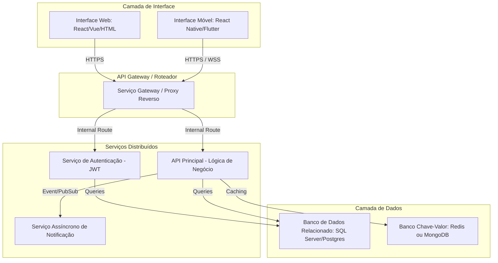

# 🏗️ Etapa 1: Contexto e Planejamento da Solução Distribuída

Este documento serve como diretriz mestre e repositório de evidências para a **Etapa 1: Contexto e Planejamento da Solução**. Ele foi estruturado de forma a facilitar o acompanhamento e auto-gestão das atividades pelos alunos.

---

## 🎯 Rubricas de Avaliação desta Etapa

Ao final desta Etapa, cada aluno será avaliado individualmente nestas 5 competências:

1. **H34a-SI-G: Gerenciar e documentar serviços de TI**: Gerenciar e documentar serviços de TI, de forma clara e objetiva (Medido na seção [Catálogo de Serviços Web](#-catalogo-de-servicos-web)).
2. **H35a-SI-G: Planejar, desenvolver e gerenciar uma arquitetura de aplicação distribuída**: Planejar e documentar uma arquitetura de aplicação distribuída, de forma clara e objetiva (Medido na seção [Arquitetura da Solução](#-arquitetura-da-solucao)).
3. **H36a-SI-G: Planejar, desenvolver e gerenciar APIs e Web Services**: Planejar e documentar APIs e Web Services, de forma clara e objetiva (Medido na seção [Especificação de Contratos de APIs](#-especificacao-de-contratos-de-apis)).
4. **H37a-SI-G: Planejar, desenvolver e gerenciar uma aplicação Web**: Planejar e documentar uma aplicação Web, de forma clara e objetiva (Medido na seção [Projeto do Frontend Web](#-projeto-do-frontend-web)).
5. **H38a-SI-G: Planejar, desenvolver e gerenciar uma aplicação móvel**: Planejar e documentar uma aplicação móvel, de forma clara e objetiva (Medido na seção [Projeto do Frontend-Movel](#-projeto-do-frontend-movel)).

---

## 📅 Cronograma do Semestre (Semana → Período)

Esta tabela é a referência única de planejamento semanal do projeto, usada por todas as Etapas. Ela usa **número relativo de semana** (Semana 1, Semana 2...), não datas fixas, para que o template continue válido em qualquer semestre — cada turma ancora a "Semana 1" na semana real de início da disciplina.

| Semana | Etapa | Atividade Prevista |
| :---: | :---: | :--- |
| 1 | 1 | Apresentação do Projeto |
| 2 | 1 | Definição dos Temas e Organização dos Grupos |
| 3 | 1 | Especificações do Projeto |
| 4 | 1 | Arquitetura da Solução |
| 5 | 2 | Desenvolvimento de Funcionalidades - API (inclui apresentação da Etapa 1) |
| 6 | 2 | Desenvolvimento de Funcionalidades - API |
| 7 | 2 | Desenvolvimento de Funcionalidades - API |
| 8 | 2 | Desenvolvimento de Funcionalidades - API |
| 9 | 2 | Testes - API |
| 10 | 3 | Desenvolvimento de Funcionalidades - Web (inclui apresentação da Etapa 2) |
| 11 | 3 | Desenvolvimento de Funcionalidades - Web |
| 12 | 3 | Desenvolvimento de Funcionalidades - Web |
| 13 | 3 | Testes - Front-End Web |
| 14 | 4 | Desenvolvimento de Funcionalidades - Mobile (inclui apresentação da Etapa 3) |
| 15 | 4 | Desenvolvimento de Funcionalidades - Mobile |
| 16 | 4 | Desenvolvimento de Funcionalidades - Mobile |
| 17 | 4 | Testes - Front-End Mobile |
| 18 | 5 | Apresentação Final do Projeto |

*As Semanas 1 e 2 não possuem tarefa de documentação associada (organização inicial do grupo e apresentação do projeto).*

---

## 📅 QUADRO DE CONTRIBUIÇÃO REAL (ETAPA 1)

**Atenção alunos:** Preencham esta tabela para atualizar o andamento das tarefas e quem foi o responsável por cada entrega. Garanta que o nome, usuário do GitHub e o link para a seção onde está o seu trabalho estejam devidamente preenchidos.

- **Status admitidos**: `⌛ Não Iniciado` | `📝 Em Progresso` | `✔️ Entregue`
- **Autoria Git**: Indica se há commits desse estudante modificando a seção correspondente.

**Atividades Semanais desta Etapa** (ver [Cronograma do Semestre](#-cronograma-do-semestre-semana--periodo)):
- `ATV1.1` — Especificações do Projeto (Semana 3)
- `ATV1.2` — Arquitetura da Solução (Semana 4)

| Rubrica Curricular | ID Tarefa | Atividade Semanal | Descrição Detalhada da Tarefa | Estudante Responsável | GitHub Username | Status de Entrega | Evidência/Seção Temática | Autoria Git |
| :---: | :---: | :---: | :--- | :--- | :---: | :---: | :--- | :---: |
| **H34a** | `T1.1` | `ATV1.1` | Definição do Problema, Objetivos e Justificativa | [Nome do Aluno 1] | `username1` | `⌛ Não Iniciado` | [Seção 1](#11-problema-objetivos-e-justificativa) | [ ] |
| **H34a** | `T1.2` | `ATV1.1` | Descrição das Personas e Mapa de Stakeholders | [Nome do Aluno 2] | `username2` | `⌛ Não Iniciado` | [Seção 1.2](#12-personas-e-stakeholders) | [ ] |
| **H34a** | `T1.3` | `ATV1.1` | Definição de Requisitos Funcionais e Priorização | [Nome do Aluno 3] | `username3` | `⌛ Não Iniciado` | [Seção 2.1](#21-requisitos-funcionais-e-não-funcionais) | [ ] |
| **H34a** | `T1.4` | `ATV1.1` | Catálogo de Serviços Web e Acordos de SLA | [Nome do Aluno 1] | `username1` | `⌛ Não Iniciado` | [Seção 3.0](#-catalogo-de-servicos-web) | [ ] |
| **H35a** | `T1.5` | `ATV1.2` | Diagrama de Componentes Físico e Lógico da Solução | [Nome do Aluno 4] | `username4` | `⌛ Não Iniciado` | [Seção 4.1](#41-diagrama-de-arquitetura) | [ ] |
| **H35a** | `T1.6` | `ATV1.2` | Definição das Tecnologias Distribuídas e Hospedagem | [Nome do Aluno 5] | `username5` | `⌛ Não Iniciado` | [Seção 4.2](#42-tecnologias-e-hospedagem) | [ ] |
| **H36a** | `T1.7` | `ATV1.2` | Especificação de Contratos de API (Endpoints/Verbos) | [Nome do Aluno 6] | `username6` | `⌛ Não Iniciado` | [Seção 5.0](#-especificacao-de-contratos-de-apis) | [ ] |
| **H37a** | `T1.8` | `ATV1.2` | Wireframes do Frontend Web e Fluxograma de Navegação | [Nome do Aluno 3] | `username3` | `⌛ Não Iniciado` | [Seção 6.0](#-projeto-do-frontend-web) | [ ] |
| **H38a** | `T1.9` | `ATV1.2` | Wireframes do Frontend Móvel e Fluxo de Gestos | [Nome do Aluno 2] | `username2` | `⌛ Não Iniciado` | [Seção 7.0](#-projeto-do-frontend-movel) | [ ] |

---

# 1. Introdução e Contexto

[Esta seção introduz o contexto de negócios e define os limites do problema.]

## 1.1. Problema, Objetivos e Justificativa

* **O Problema**:
  [Descreva a dor específica do mercado que gerou a necessidade deste sistema. Não fale sobre as soluções tecnológicas aqui; foque na atividade humana ou do negócio que está sofrendo a ineficiência.]
  
  *Exemplo de Orientação:* Para uma plataforma de logística urbana, o problema reside na latência de roteamento de pacotes pequenos e na falta de visibilidade em tempo real para os destinatários.

* **Objetivo Geral**:
  [O objetivo geral deve começar com um verbo no infinitivo (ex: Desenvolver, Implementar, Criar) e refletir a solução global do problema.]

* **Objetivos Críticos Específicos (Mínimo de 3)**:
  1. [Objetivo técnico focado em interoperabilidade/API distribuída]
  2. [Objetivo operacional focado na experiência web ou móvel]
  3. [Objetivo de infraestrutura focado em tolerância a falhas ou performance]

* **Justificativa**:
  [Por que este projeto é relevante sob o ponto de vista prático, social, ambiental, ou de otimização de TI? Use números, estatísticas ou justificativas de mercado.]

---

## 1.2. Personas e Stakeholders

[As personas e stakeholders ajudam a desenhar as interfaces de usuário da aplicação distribuída (Web e Mobile).]

### Persona 1: [Nome Fictício]
- **Perfil e Atitude**: [Idade, profissão, nível de familiaridade com tecnologia e ferramentas móveis/web]
- **Frustração com o Modelo Atual**: [O que o irrita no problema que estamos resolvendo?]
- **Como a Solução o Ajuda**: [Qual software/aplicativo ele usará e qual o valor que extrai de maneira direta]

### Persona 2: [Nome Fictício]
- **Perfil e Atitude**: [Ex: Gerente de Operações, Motorista parceiro, etc.]
- **Frustração**: ...
- **Como a Solução o Ajuda**: ...

### Mapa de Interesses dos Stakeholders:
- **Stakeholders Diretos (Atores principais)**: [Usuários web, usuários móveis]
- **Stakeholders Indiretos (Quem é alterado pelo sistema)**: [Administradores de infraestrutura, fornecedores]

---

# 2. Especificações do Projeto

## 2.1. Requisitos Funcionais e Não Funcionais

### Requisitos Funcionais (RF)

| ID | Descrição do Requisito | Canal Prático (Onde ocorre?) | Prioridade | Rubrica Associada |
| :---: | :--- | :---: | :---: | :---: |
| `RF-101` | [Ex: Permitir que o gestor despache uma frota de entregadores] | Web | Alta | `H37a` |
| `RF-102` | [Ex: Permitir que o entregador de campo aceite a corrida] | Móvel | Alta | `H38a` |
| `RF-103` | [Ex: Expor serviços de geolocalização sincronizados] | API / Backend | Alta | `H36a` |

### Requisitos Não Funcionais (RNF)

| ID | Descrição do Requisito Técnico | Categoria | Prioridade | Rubrica Associada |
| :---: | :--- | :---: | :---: | :---: |
| `RNF-201` | [Ex: Sincronização offline-first das corridas no cliente móvel] | Disponibilidade | Alta | `H38a`, `H35a` |
| `RNF-202` | [Ex: Tempo de resposta para requisições de leitura menor que 1.5s] | Desempenho | Alta | `H36a`, `H35a` |

---

# 3. Catálogo de Serviços Web

*(Esta seção atende diretamente à rubrica **H34a**)*

[Análise técnica de como a lógica de TI será gerenciada. No contexto de Aplicações Distribuídas, descreva quais serviços do sistema são executados como processos independentes ou acoplados].

Use a tabela abaixo para mapear a Gestão de Serviços de TI que o grupo irá disponibilizar:

| Serviço de TI | Canal de Comunicação | Nível de Serviço (SLA) Esperado | Mecanismo de Monitoração | Responsável |
| :--- | :---: | :---: | :--- | :---: |
| **Serviço de Autenticação Centralizado (Identity)** | JSON / HTTPS | 99.9% de uptime / Up em < 2s pós queda | LOGs de Auditoria / Middleware de telemetria | [Nome do Aluno] |
| **Serviço de Processamento de Pagamento** | Mensageria / AMQP | Processamento em no máximo 10 segundos | Fila Morta (Dead Letter Queues) | [Nome do Aluno] |
| **Serviço de Geolocalização em Tempo Real** | WebSockets | Latência máxima de sincronismo < 300ms | Heartbeats a cada 5 segundos | [Nome do Aluno] |

---

# 4. Arquitetura da Solução

*(Esta seção atende diretamente à rubrica **H35a**)*

## 4.1. Diagrama de Arquitetura

[Insira aqui o link ou imagem do Diagrama de Componentes que demonstra fisicamente a distribuição do seu sistema. Mostre o fluxo de chamadas entre as interfaces Web e Mobile passando pelo API Gateway/API Backend, e a consequente comunicação com Bancos de Dados e Serviços de mensageria ou serviços externos.]



---

## 4.2. Tecnologias e Hospedagem

Descreva e justifique as escolhas da pilha de desenvolvimento distribuída:

* **Backend / API**: [Ex: Node.js (TypeScript) ou .NET 8 (C#) ou Spring Boot (Java)]. *Justificativa técnica baseada em performance concorrente.*
* **Frontend Web**: [Ex: React ou Angular]. *Justificativa com foco no dinamismo e Single Page Application.*
* **Frontend Móvel**: [Ex: React Native via Expo]. *Enquadramento das características nativas necessárias (câmera, sensores, offline).*
* **Banco de Dados**: [Ex: PostgreSQL e Redis]. *Papel de persistência relacional ácida e cache em memória distributed.*
* **Hospedagem em Nuvem**: [Ex: AWS para API e Banco de Dados, Vercel para interface Web, e Expo Go / APK para Mobile].

---

# 5. Especificação de Contratos de APIs

*(Esta seção atende diretamente à rubrica **H36a**)*

[Definição formal dos endpoints chaves de comunicação que servirão para o desenvolvimento na Etapa 2.]

### Endpoint Exemplo 1: Autenticação de Usuários (`/api/v1/auth/login`)
- **Método**: `POST`
- **Payload de Requisição**:
  ```json
  {
    "email": "user@pucminas.br",
    "password": "hashed_password"
  }
  ```
- **Resposta Sucesso (`200 OK`)**:
  ```json
  {
    "token": "eyJhbGciOiJIUzI1NiIsInR5cCI6IkpXVCJ9...",
    "expiresIn": 3600,
    "user": { "id": 123, "nome": "Aluno Exemplar", "funcao": "admin" }
  }
  ```

### Endpoint Exemplo 2: Recuperação de Dados do Usuário (`/api/v1/users/{id}`)
- **Método**: `GET`
- ...

---

# 6. Projeto do Frontend Web

*(Esta seção atende diretamente à rubrica **H37a**)*

[Aqui o grupo deve descrever as interações que o usuário do canal Web executará de forma responsiva.]

### 6.1. Relação de Telas do Sistema Web:
- **Tela 1: Dashboard Administrativo**: [Descreva que informações e gráficos estarão expostos na console]
- **Tela 2: Cadastro de Entidades**: ...

### 6.2. Wireframes Web:
[Insira aqui os esboços que demonstram visualmente os layouts desktop, explicando onde haverá consumo assíncrono das APIs mapeadas]

---

# 7. Projeto do Frontend Móvel

*(Esta seção atende diretamente à rubrica **H38a**)*

[Aqui deve ser demonstrada a preocupação espacial e gestual exclusiva do ecossistema móvel.]

### 7.1. Fluxograma de Navegação (Navegabilidade):
- **Tela 1: Tela de Entrada e Login**: [Explique o formulário nativo]
- **Tela 2: Tela Principal com Mapa / Listagem Interativa**: ...

### 7.2. Wireframes Móveis:
[Insira aqui o link ou imagens dos wireframes desenhados para telefones. Demonstre usabilidade focada em uma mão, menus hamburguer, navegação por guias (tabs) e comportamentos de transição de tela.]

---

# 8. Referências Acadêmicas e de Engenharia

[Utilize literatura formal para dar suporte técnico ao seu planejamento.]

1. **SOMMERVILLE, Ian**. *Engenharia de Software*. 10. ed. São Paulo: Pearson, 2011.
2. **COULOURIS, George et al**. *Sistemas Distribuídos: conceitos e projeto*. 5. ed. Porto Alegre: Bookman, 2013.
3. **FIELDING, Roy Thomas**. *Architectural Styles and the Design of Network-based Software Architectures*. Dissertação (Doutorado) - University of California, Irvine, 2000.
