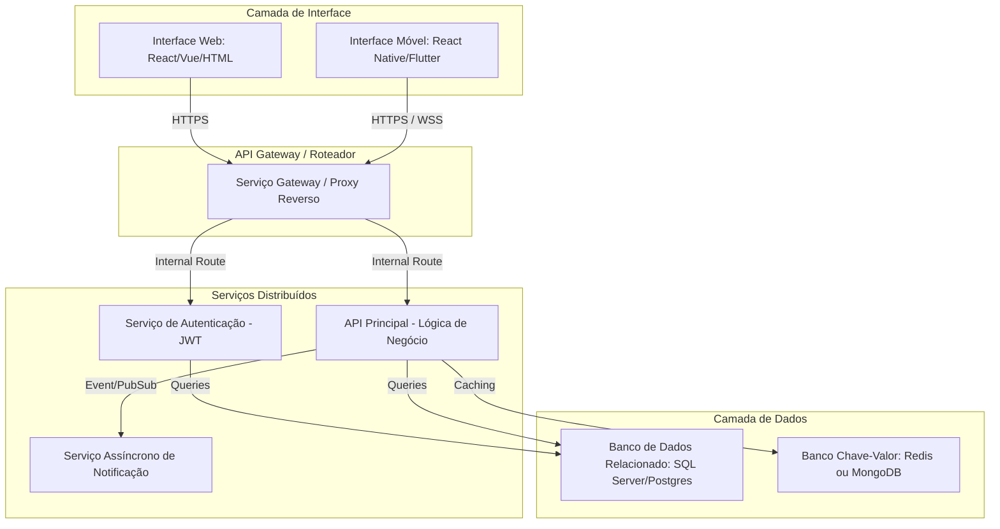

# 🏗️ Etapa 1: Contexto e Planejamento da Solução Distribuída

Este documento serve como diretriz mestre e repositório de evidências para a **Etapa 1: Contexto e Planejamento da Solução**. Ele foi estruturado de forma a facilitar o acompanhamento e auto-gestão das atividades pelos alunos.

---

## 🎯 Rubricas de Avaliação desta Etapa

Ao final desta Etapa, cada aluno será avaliado individualmente nestas 5 competências:

1. **H34a-SI-G: Gerenciar e documentar serviços de TI**: Gerenciar e documentar serviços de TI, de forma clara e objetiva (Medido na seção [Catálogo de Serviços Web](#-catalogo-de-servicos-web)).
2. **H35a-SI-G: Planejar, desenvolver e gerenciar uma arquitetura de aplicação distribuída**: Planejar e documentar uma arquitetura de aplicação distribuída, de forma clara e objetiva (Medido na seção [Arquitetura da Solução](#-arquitetura-da-solucao)).
3. **H36a-SI-G: Planejar, desenvolver e gerenciar APIs e Web Services**: Planejar e documentar APIs e Web Services, de forma clara e objetiva (Medido na seção [Especificação de Contratos de APIs](#-especificacao-de-contratos-de-apis)).
4. **H37a-SI-G: Planejar, desenvolver e gerenciar uma aplicação Web**: Planejar e documentar uma aplicação Web, de forma clara e objetiva (Medido na seção [Projeto do Frontend Web](#-projeto-do-frontend-web)).
5. **H38a-SI-G: Planejar, desenvolver e gerenciar uma aplicação móvel**: Planejar e documentar uma aplicação móvel, de forma clara e objetiva (Medido na seção [Projeto do Frontend-Movel](#-projeto-do-frontend-movel)).

---

## 📅 Cronograma do Semestre (Semana → Período)

Esta tabela é a referência única de planejamento semanal do projeto, usada por todas as Etapas. Ela usa **número relativo de semana** (Semana 1, Semana 2...), não datas fixas, para que o template continue válido em qualquer semestre — cada turma ancora a "Semana 1" na semana real de início da disciplina.

| Semana | Etapa | Atividade Prevista |
| :---: | :---: | :--- |
| 1 | 1 | Apresentação do Projeto |
| 2 | 1 | Definição dos Temas e Organização dos Grupos |
| 3 | 1 | Especificações do Projeto |
| 4 | 1 | Arquitetura da Solução |
| 5 | 2 | Desenvolvimento de Funcionalidades - API (inclui apresentação da Etapa 1) |
| 6 | 2 | Desenvolvimento de Funcionalidades - API |
| 7 | 2 | Desenvolvimento de Funcionalidades - API |
| 8 | 2 | Desenvolvimento de Funcionalidades - API |
| 9 | 2 | Testes - API |
| 10 | 3 | Desenvolvimento de Funcionalidades - Web (inclui apresentação da Etapa 2) |
| 11 | 3 | Desenvolvimento de Funcionalidades - Web |
| 12 | 3 | Desenvolvimento de Funcionalidades - Web |
| 13 | 3 | Testes - Front-End Web |
| 14 | 4 | Desenvolvimento de Funcionalidades - Mobile (inclui apresentação da Etapa 3) |
| 15 | 4 | Desenvolvimento de Funcionalidades - Mobile |
| 16 | 4 | Desenvolvimento de Funcionalidades - Mobile |
| 17 | 4 | Testes - Front-End Mobile |
| 18 | 5 | Apresentação Final do Projeto |

*As Semanas 1 e 2 não possuem tarefa de documentação associada (organização inicial do grupo e apresentação do projeto).*

---

## 📅 QUADRO DE CONTRIBUIÇÃO REAL (ETAPA 1)

**Atenção alunos:** Preencham esta tabela para atualizar o andamento das tarefas e quem foi o responsável por cada entrega. Garanta que o nome, usuário do GitHub e o link para a seção onde está o seu trabalho estejam devidamente preenchidos.

- **Status admitidos**: `⌛ Não Iniciado` | `📝 Em Progresso` | `✔️ Entregue`
- **Autoria Git**: Indica se há commits desse estudante modificando a seção correspondente.

**Atividades Semanais desta Etapa** (ver [Cronograma do Semestre](#-cronograma-do-semestre-semana--periodo)):
- `ATV1.1` — Especificações do Projeto (Semana 3)
- `ATV1.2` — Arquitetura da Solução (Semana 4)

| Rubrica Curricular | ID Tarefa | Atividade Semanal | Descrição Detalhada da Tarefa | Estudante Responsável | GitHub Username | Status de Entrega | Evidência/Seção Temática | Autoria Git |
| :---: | :---: | :---: | :--- | :--- | :---: | :---: | :--- | :---: |
| **H34a** | `T1.1` | `ATV1.1` | Definição do Problema, Objetivos e Justificativa | Allan | `AllanAviana` | `✔️ Entregue` | [Seção 1](#11-problema-objetivos-e-justificativa) | [ ] |
| **H34a** | `T1.2` | `ATV1.1` | Descrição das Personas e Mapa de Stakeholders | Roberta | `RobertaAlvesLima` |  `✔️ Entregue` | [Seção 1.2](#12-personas-e-stakeholders) | [ ] |
| **H34a** | `T1.3` | `ATV1.1` | Definição de Requisitos Funcionais e Priorização | Giovanny | `glisboapuc` | `📝 Em Progresso` | [Seção 2.1](#21-requisitos-funcionais-e-não-funcionais) | [ ] |
| **H34a** | `T1.4` | `ATV1.1` | Catálogo de Serviços Web e Acordos de SLA | Allan | `AllanAviana` | `📝 Em Progresso` | [Seção 3.0](#-catalogo-de-servicos-web) | [ ] |
| **H35a** | `T1.5` | `ATV1.2` | Diagrama de Componentes Físico e Lógico da Solução | Gustavo | `Gust2003` | `📝 Em Progresso` | [Seção 4.1](#41-diagrama-de-arquitetura) | [ ] |
| **H35a** | `T1.6` | `ATV1.2` | Definição das Tecnologias Distribuídas e Hospedagem | Pedro | `username5` | `📝 Em Progresso` | [Seção 4.2](#42-tecnologias-e-hospedagem) | [ ] |
| **H36a** | `T1.7` | `ATV1.2` | Especificação de Contratos de API (Endpoints/Verbos) | Giovanny | `glisboapuc` | `📝 Em Progresso` | [Seção 5.0](#-especificacao-de-contratos-de-apis) | [ ] |
| **H37a** | `T1.8` | `ATV1.2` | Wireframes do Frontend Web e Fluxograma de Navegação | André | `dezim005` | `✔️ Entregue` | [Seção 6.0](#-projeto-do-frontend-web) | [ ] |
| **H38a** | `T1.9` | `ATV1.2` | Wireframes do Frontend Móvel e Fluxo de Gestos | André | `dezim005` | `✔️ Entregue` | [Seção 7.0](#-projeto-do-frontend-movel) | [ ] |

---

# 1. Introdução e Contexto

[Esta seção introduz o contexto de negócios e define os limites do problema.]

## 1.1. Problema, Objetivos e Justificativa

* **O Problema**:
  Em condomínios residenciais, a gestão de vagas de estacionamento é **manual e descentralizada**. Moradores com vagas ociosas não possuem um canal formal para disponibilizá-las; quem precisa de vaga recorre a combinações informais — grupos de mensagem, avisos na portaria ou acordos verbais — **sem registro confiável** de quem utiliza a vaga, por quanto tempo ou com qual autorização.

  Essa ineficiência gera três consequências diretas: (1) **subutilização do recurso** — vagas ociosas enquanto existe demanda no mesmo condomínio; (2) **conflitos entre moradores** — disputas por uso indevido ou falta de vaga, com mediação recorrente do síndico; (3) **sobrecarga administrativa** — portaria e síndico atuam de forma reativa, sem histórico auditável de ocupação.

  Segundo o IBGE, mais de **13 milhões de domicílios** estão em condomínios no Brasil. Em edifícios com poucas vagas por unidade, a disputa por espaço é recorrente. Métodos informais (planilhas, mensagens) **não escalam** e **não permitem auditoria** do uso compartilhado.

* **Objetivo Geral**:
  **Desenvolver** uma solução para **cadastrar, consultar, reservar e gerenciar vagas de estacionamento compartilhadas** em condomínios, partindo do protótipo web **Vaga Livre** e evoluindo para uma arquitetura distribuída com backend, interface web e aplicativo móvel.

* **Objetivos Críticos Específicos**:
  1. [Interoperabilidade / API distribuída] Implementar uma API REST centralizada para autenticação, gestão de vagas, reservas e aprovação de moradores, garantindo que web e mobile consumam as mesmas regras de negócio.
  2. [Experiência web ou móvel] Oferecer painel web ao síndico para aprovações, histórico e gestão administrativa, e aplicativo móvel ao morador para consulta e reserva no dia a dia.
  3. [Infraestrutura — tolerância a falhas / performance] Adotar persistência gerenciada em nuvem, cache para consultas frequentes e monitoração contínua, com metas de disponibilidade e tempo de resposta acordadas.

* **Justificativa**:
  O projeto é relevante sob o ponto de vista **prático**, pois condomínios já utilizam aplicativos para portaria e reserva de áreas comuns; a gestão de vagas é extensão natural desse ecossistema, com demanda recorrente em áreas urbanas densas (contexto reforçado pelos dados do IBGE sobre domicílios em condomínios).

  Sob o ponto de vista **social**, reduz conflitos entre moradores e diminui a carga operacional sobre síndico e portaria. Sob o ponto de vista **ambiental**, o melhor aproveitamento de vagas já existentes pode reduzir o tempo de busca por estacionamento na via pública — benefício potencial a ser validado em uso real. Sob o ponto de vista de **otimização de TI**, centralizar dados e regras em um backend substitui a persistência local isolada do protótipo atual, permitindo que múltiplos usuários compartilhem a mesma base de informações de forma segura e consistente.
---

## 1.2. Personas e Stakeholders

[As personas e stakeholders ajudam a desenhar as interfaces de usuário da aplicação distribuída (Web e Mobile).]

### Persona 1: Renata Almeida
- **Perfil e Atitude**: Renata tem 27 anos, é empreendedora digital e trabalha com influências digitais e freelancing. Possui boa habilidade com tecnologia, redes sociais e plataformas digitais de gestão.
- **Frustração com o Modelo Atual**: Falta de controle e organização com as reservas de vagas entre vizinhos e dificuldade de divulgar sua vaga.
- **Como a Solução o Ajuda**: Sua rotina é flexível, mas cheia de compromissos, por isso ela valoriza a praticidade e o controle. Utilizar o VagaLivre lhe ajudará a reservar vagas da garagem, quando necessário, com facilidade e rapidez, além de poder divulgar sua vaga para gerar uma renda extra.

### Persona 2: Pedro Souza
- **Perfil e Atitude**: Pedro tem 68 anos e está aposentado. Não tem experiência com novas tecnologias, atualmente utiliza apenas grupos de mensagens entre amigos e familiares e, eventualmente, navega em sites de notícias pelo celular.
- **Frustração**: Pedro não dirige no momento e está sem carro próprio. Sua vaga fica disponível, e alguns vizinhos a pedem emprestado. Pedro gostaria de gerar uma renda extra no aluguel dessa vaga, mas tem muita dificuldade em buscar soluções tecnológicas. 
- **Como a Solução o Ajuda**: Pedro precisa de uma solução de fácil usabilidade para gerenciar sua vaga de garagem. O VagaLivre se apresenta como uma solução simples, sem funcionalidades complexas.

### Persona 3: Ana Mendes
- **Perfil e Atitude**: Ana tem 40 anos, é administradora e síndica de um condomínio.
- **Frustração**: Ana segue um regimento interno de seu condomínio que não apresenta regras quanto a utilização e empréstimos de vagas de garagem. De maneira informal, através de aplicativos de mensagens, os vizinhos solicitam vagas quando necessitam e os empréstimos ocorrem sem formalização e tempo de utilização. Com isso, ocorrem conflitos entre moradores e não há uma solução para gerenciar essa demanda.
- **Como a Solução o Ajuda**: Uma solução como o VagaLivre lhe ajudaria na gestão e organização entre as solicitações de vagas. A implementação de uma solução digital para manejo das vagas de garagem irá garantir uma gestão eficiente, maior transparência e otimização da comunicação entre os moradores.

### Mapa de Interesses dos Stakeholders:
- **Stakeholders Diretos (Atores principais)**:
  - Síndico do condomínio: responsável pela administração e controle das vagas.
  - Moradores/condôminos: usuários que consultarão e utilizarão o sistema para acompanhar informações relacionadas às vagas.
  - Porteiros/funcionários autorizados: podem utilizar o sistema para consultar e controlar informações sobre a ocupação das vagas.
    
- **Stakeholders Indiretos (Quem é alterado pelo sistema)**:
  - Administradora do condomínio: pode ser beneficiada pela melhoria na organização e no controle das informações.
  - Conselho do condomínio: interessado na transparência e no cumprimento das regras relacionadas às vagas.
  - Visitantes: podem ser impactados pelas regras e pela disponibilidade de vagas controladas pelo sistema.
---

# 2. Especificações do Projeto

## 2.1. Requisitos Funcionais e Não Funcionais

Os requisitos do sistema **VagaLivre** foram definidos a partir do problema identificado, das necessidades das personas e dos fluxos previstos para as aplicações Web e Móvel.

Para a priorização dos requisitos funcionais, foram considerados três níveis:

- **Alta:** funcionalidade indispensável para o funcionamento do fluxo principal da solução. Sua ausência impede ou compromete diretamente o uso do sistema.
- **Média:** funcionalidade importante para administração, acompanhamento ou melhoria da experiência, mas que não impede a execução do fluxo principal.
- **Baixa:** funcionalidade complementar, que pode ser implementada posteriormente sem comprometer a operação essencial da solução.

O fluxo principal considerado para o MVP é: **autenticar usuário → disponibilizar vaga → consultar disponibilidade → realizar reserva → acompanhar ou cancelar reserva**, mantendo as informações centralizadas e disponíveis para moradores e administração do condomínio.

### Requisitos Funcionais (RF)

| ID | Descrição do Requisito | Canal Prático (Onde ocorre?) | Prioridade | Rubrica Associada |
| :---: | :--- | :---: | :---: | :---: |
| `RF-101` | Permitir que usuários autentiquem-se no sistema utilizando suas credenciais, identificando seu perfil e suas permissões de acesso. | Web / Móvel | Alta | `H36a`, `H37a`, `H38a` |
| `RF-102` | Permitir o cadastro ou solicitação de acesso de moradores vinculados a um condomínio. | Móvel / API | Alta | `H36a`, `H38a` |
| `RF-103` | Permitir que o síndico aprove ou rejeite solicitações de acesso de moradores ao condomínio. | Web | Alta | `H36a`, `H37a` |
| `RF-104` | Permitir que usuários administrativos cadastrem e mantenham os dados do condomínio no sistema. | Web | Alta | `H36a`, `H37a` |
| `RF-105` | Permitir que o proprietário cadastre, consulte, edite e remova suas vagas, informando características como identificação, tipo de veículo permitido, valor e disponibilidade. | Web | Alta | `H36a`, `H37a` |
| `RF-106` | Permitir que o proprietário defina os dias e horários em que sua vaga estará disponível para utilização por outros moradores. | Web | Alta | `H36a`, `H37a` |
| `RF-107` | Permitir que moradores consultem as vagas disponíveis no condomínio para determinado período. | Móvel | Alta | `H36a`, `H38a` |
| `RF-108` | Permitir a aplicação de filtros na consulta de vagas, incluindo critérios como tipo de veículo e disponibilidade. | Móvel | Média | `H36a`, `H38a` |
| `RF-109` | Permitir que o morador visualize os detalhes de uma vaga antes de efetuar uma reserva, incluindo disponibilidade, período permitido, tipo de veículo e demais informações cadastradas. | Móvel | Alta | `H36a`, `H38a` |
| `RF-110` | Permitir que o morador reserve uma vaga disponível para um período específico. | Móvel | Alta | `H36a`, `H38a` |
| `RF-111` | Impedir que uma mesma vaga possua reservas conflitantes ou simultâneas para o mesmo período. | API / Backend | Alta | `H36a` |
| `RF-112` | Permitir que o morador consulte suas reservas ativas e seu histórico de reservas. | Móvel | Alta | `H36a`, `H38a` |
| `RF-113` | Permitir que o morador cancele uma reserva ativa, respeitando as regras definidas pelo sistema. | Móvel | Alta | `H36a`, `H38a` |
| `RF-114` | Registrar de forma persistente o histórico das reservas, relacionando usuário, vaga, condomínio, período e situação da reserva. | API / Backend | Alta | `H36a` |
| `RF-115` | Permitir que síndico e usuários administrativos consultem o histórico de reservas e ocupação das vagas do condomínio. | Web | Média | `H36a`, `H37a` |
| `RF-116` | Apresentar ao síndico informações consolidadas sobre utilização das vagas, permitindo acompanhar ocupação e histórico de locações. | Web | Média | `H36a`, `H37a` |
| `RF-117` | Permitir que porteiros ou funcionários autorizados consultem informações sobre reservas e ocupação das vagas, de acordo com suas permissões de acesso. | Web | Média | `H36a`, `H37a` |

### Requisitos Não Funcionais (RNF)

Os requisitos não funcionais representam características técnicas necessárias para que a solução distribuída opere de forma segura, consistente e adequada às necessidades identificadas.

| ID | Descrição do Requisito Técnico | Categoria | Prioridade | Rubrica Associada |
| :---: | :--- | :---: | :---: | :---: |
| `RNF-201` | A aplicação Web e o aplicativo Móvel deverão utilizar uma API REST centralizada como meio de acesso às regras de negócio e aos dados persistidos. | Arquitetura / Interoperabilidade | Alta | `H35a`, `H36a` |
| `RNF-202` | Os dados de usuários, condomínios, vagas e reservas deverão ser armazenados de forma centralizada em banco de dados relacional, garantindo consistência entre os diferentes clientes da aplicação. | Persistência / Consistência | Alta | `H35a`, `H36a` |
| `RNF-203` | As comunicações entre clientes e API deverão utilizar HTTPS e mecanismos de autenticação baseados em token, com autorização de acordo com o perfil do usuário. | Segurança | Alta | `H35a`, `H36a` |
| `RNF-204` | Requisições comuns de leitura da API deverão apresentar tempo de resposta de até 2 segundos em condições normais de utilização. | Desempenho | Alta | `H35a`, `H36a` |
| `RNF-205` | Consultas frequentes de disponibilidade de vagas poderão utilizar mecanismo de cache para reduzir a latência e a carga sobre o banco de dados principal. | Desempenho | Média | `H35a`, `H36a` |
| `RNF-206` | Alterações relacionadas a reservas e autenticação deverão possuir registros que permitam rastrear as principais operações realizadas no sistema. | Auditoria / Confiabilidade | Alta | `H34a`, `H36a` |
| `RNF-207` | A solução deverá possuir mecanismos de monitoração que permitam identificar indisponibilidade ou falhas nos serviços centrais da aplicação. | Disponibilidade / Monitoramento | Média | `H34a`, `H35a` |

### Justificativa da Priorização

A priorização concentra o desenvolvimento inicial nas funcionalidades que resolvem diretamente o problema identificado no projeto.

Os requisitos classificados como **Alta prioridade** formam o fluxo mínimo necessário para funcionamento do VagaLivre: identificação dos usuários, administração dos acessos, cadastramento e disponibilização das vagas, consulta da disponibilidade, realização e gerenciamento das reservas e persistência centralizada das informações.

Os requisitos classificados como **Média prioridade** complementam o fluxo principal, oferecendo recursos de filtragem, acompanhamento administrativo, indicadores e consultas destinadas à gestão do condomínio.

Essa organização permite que o desenvolvimento seja realizado de maneira incremental. Inicialmente, a API poderá atender ao fluxo essencial de vagas e reservas; posteriormente, as interfaces Web e Móvel poderão consumir esses mesmos serviços e incorporar as funcionalidades administrativas e de experiência previstas para cada canal.

---

# 3. Catálogo de Serviços Web

*(Esta seção atende diretamente à rubrica **H34a**)*

[Análise técnica de como a lógica de TI será gerenciada. No contexto de Aplicações Distribuídas, descreva quais serviços do sistema são executados como processos independentes ou acoplados].

Use a tabela abaixo para mapear a Gestão de Serviços de TI que o grupo irá disponibilizar:

| Serviço de TI | Canal de Comunicação | Nível de Serviço (SLA) Esperado | Mecanismo de Monitoração | Responsável |
| :--- | :---: | :---: | :--- | :---: |
| **Serviço de Autenticação Centralizado (Identity)** | JSON / HTTPS | 99.9% de uptime / Up em < 2s pós queda | LOGs de Auditoria / Middleware de telemetria | [Nome do Aluno] |
| **Serviço de Processamento de Pagamento** | Mensageria / AMQP | Processamento em no máximo 10 segundos | Fila Morta (Dead Letter Queues) | [Nome do Aluno] |
| **Serviço de Geolocalização em Tempo Real** | WebSockets | Latência máxima de sincronismo < 300ms | Heartbeats a cada 5 segundos | [Nome do Aluno] |

---

# 4. Arquitetura da Solução

*(Esta seção atende diretamente à rubrica **H35a**)*

## 4.1. Diagrama de Arquitetura

[Insira aqui o link ou imagem do Diagrama de Componentes que demonstra fisicamente a distribuição do seu sistema. Mostre o fluxo de chamadas entre as interfaces Web e Mobile passando pelo API Gateway/API Backend, e a consequente comunicação com Bancos de Dados e Serviços de mensageria ou serviços externos.]



---

## 4.2. Tecnologias e Hospedagem

Descreva e justifique as escolhas da pilha de desenvolvimento distribuída:

* **Backend / API**: [Node.js com TypeScript e NestJS]. - A escolha se justifica pela boa capacidade de lidar com múltiplas requisições simultâneas, facilidade de desenvolvimento de APIs REST escaláveis e integração natural com o ecossistema JavaScript já adotado no projeto. O uso de TypeScript melhora a organização, a tipagem e a manutenção do código, enquanto o NestJS oferece uma arquitetura modular adequada para sistemas distribuídos.
  
* **Frontend Web**: [Next.js com TypeScript, Tailwind CSS e shadcn/ui]. - A escolha se justifica pela criação de interfaces dinâmicas, reativas e responsivas, com ótima organização para aplicações web modernas no modelo Single Page Application. Além disso, o Next.js se integra bem ao React e facilita a evolução do protótipo atual para consumo assíncrono da API.
  
* **Frontend Móvel**: [React Native com Expo e TypeScript]. - A escolha se justifica pela possibilidade de desenvolvimento multiplataforma para Android e iOS com uma única base de código, além da boa integração com recursos nativos do dispositivo móvel. O Expo facilita testes, emulação e distribuição inicial do aplicativo, atendendo bem às necessidades do projeto.
  
* **Banco de Dados**: [PostgreSQL e Redis]. - O PostgreSQL será utilizado como banco de dados relacional principal, garantindo consistência, integridade e suporte transacional para entidades como usuários, vagas e reservas. Já o Redis atuará como cache em memória distribuído, acelerando consultas frequentes, especialmente relacionadas à disponibilidade das vagas, melhorando o desempenho geral do sistema.
  
* **Hospedagem em Nuvem**: [Vercel para o Frontend Web, Render para a API Backend, Neon para o PostgreSQL e Upstash para o Redis, além de Expo Go / APK para o Mobile] - A escolha se justifica pela simplicidade de implantação, integração com GitHub, disponibilidade de planos acessíveis para projetos acadêmicos e separação dos componentes em serviços independentes, reforçando a proposta de arquitetura distribuída do VagaLivre..

---

# 5. Especificação de Contratos de APIs

Esta seção define os principais contratos da API REST do sistema **VagaLivre**. A API será responsável pela comunicação entre as aplicações Web e Móvel e a camada central de regras de negócio e persistência.

Os endpoints foram definidos a partir dos requisitos funcionais apresentados na Seção 2.1, priorizando as operações necessárias para autenticação, gerenciamento de moradores, condomínios, vagas, disponibilidade e reservas.

A API utilizará dados no formato **JSON** e comunicação através do protocolo **HTTPS**.

Como convenção, os endpoints protegidos deverão receber o token de autenticação no cabeçalho HTTP:

```http
Authorization: Bearer <token>
Content-Type: application/json
```

A versão inicial da API utilizará o prefixo:

```text
/api/v1
```

---

## 5.1. Autenticação de Usuários

**Requisito relacionado:** `RF-101`

### Endpoint: `/api/v1/auth/login`

Realiza a autenticação do usuário e retorna um token que será utilizado nas demais requisições protegidas da API.

- **Método:** `POST`
- **Autenticação:** Não requerida

### Payload de Requisição

```json
{
  "email": "renata@email.com",
  "password": "senha_do_usuario"
}
```

### Resposta de Sucesso (`200 OK`)

```json
{
  "token": "eyJhbGciOiJIUzI1NiJ9...",
  "expiresIn": 3600,
  "user": {
    "id": 123,
    "name": "Renata Almeida",
    "email": "renata@email.com",
    "role": "resident"
  }
}
```

### Resposta de Erro (`401 Unauthorized`)

```json
{
  "error": "INVALID_CREDENTIALS",
  "message": "E-mail ou senha inválidos."
}
```

---

## 5.2. Solicitação de Acesso de Morador

**Requisito relacionado:** `RF-102`

### Endpoint: `/api/v1/residents`

Permite que um morador solicite seu vínculo a determinado condomínio.

- **Método:** `POST`
- **Autenticação:** Requerida

### Payload de Requisição

```json
{
  "condominiumId": 10,
  "apartment": "82",
  "block": "B"
}
```

### Resposta de Sucesso (`201 Created`)

```json
{
  "id": 45,
  "userId": 123,
  "condominiumId": 10,
  "apartment": "82",
  "block": "B",
  "status": "pending"
}
```

### Resposta de Erro (`409 Conflict`)

```json
{
  "error": "REQUEST_ALREADY_EXISTS",
  "message": "Já existe uma solicitação de acesso para este usuário."
}
```

---

## 5.3. Aprovação de Morador

**Requisito relacionado:** `RF-103`

### Endpoint: `/api/v1/residents/{id}/status`

Permite que o síndico aprove ou rejeite uma solicitação de acesso ao condomínio.

- **Método:** `PATCH`
- **Autenticação:** Requerida
- **Perfil autorizado:** Síndico/Administrador

### Payload de Requisição

```json
{
  "status": "approved"
}
```

Também poderá ser utilizado:

```json
{
  "status": "rejected"
}
```

### Resposta de Sucesso (`200 OK`)

```json
{
  "id": 45,
  "userId": 123,
  "condominiumId": 10,
  "status": "approved"
}
```

### Resposta de Erro (`403 Forbidden`)

```json
{
  "error": "FORBIDDEN",
  "message": "O usuário não possui permissão para realizar esta operação."
}
```

---

## 5.4. Cadastro de Condomínio

**Requisito relacionado:** `RF-104`

### Endpoint: `/api/v1/condominiums`

Permite cadastrar um condomínio que será gerenciado pelo sistema.

- **Método:** `POST`
- **Autenticação:** Requerida
- **Perfil autorizado:** Administrador

### Payload de Requisição

```json
{
  "name": "Residencial Parque Central",
  "address": {
    "street": "Rua das Flores",
    "number": "120",
    "city": "Belo Horizonte",
    "state": "MG",
    "zipCode": "30100-000"
  }
}
```

### Resposta de Sucesso (`201 Created`)

```json
{
  "id": 10,
  "name": "Residencial Parque Central",
  "address": {
    "street": "Rua das Flores",
    "number": "120",
    "city": "Belo Horizonte",
    "state": "MG",
    "zipCode": "30100-000"
  },
  "createdAt": "2026-08-30T10:30:00Z"
}
```

---

## 5.5. Cadastro de Vaga

**Requisito relacionado:** `RF-105`

### Endpoint: `/api/v1/spots`

Permite que um morador proprietário cadastre uma vaga de estacionamento.

- **Método:** `POST`
- **Autenticação:** Requerida

### Payload de Requisição

```json
{
  "condominiumId": 10,
  "identifier": "Vaga 82",
  "vehicleType": "car",
  "price": 25.00
}
```

### Resposta de Sucesso (`201 Created`)

```json
{
  "id": 230,
  "ownerId": 123,
  "condominiumId": 10,
  "identifier": "Vaga 82",
  "vehicleType": "car",
  "price": 25.00,
  "status": "active"
}
```

### Resposta de Erro (`422 Unprocessable Entity`)

```json
{
  "error": "VALIDATION_ERROR",
  "message": "Os dados enviados são inválidos."
}
```

---

## 5.6. Definição de Disponibilidade da Vaga

**Requisito relacionado:** `RF-106`

### Endpoint: `/api/v1/spots/{id}/availability`

Define um período no qual determinada vaga poderá ser reservada.

- **Método:** `POST`
- **Autenticação:** Requerida

### Payload de Requisição

```json
{
  "startAt": "2026-09-01T08:00:00-03:00",
  "endAt": "2026-09-01T18:00:00-03:00"
}
```

### Resposta de Sucesso (`201 Created`)

```json
{
  "id": 501,
  "spotId": 230,
  "startAt": "2026-09-01T08:00:00-03:00",
  "endAt": "2026-09-01T18:00:00-03:00",
  "status": "available"
}
```

---

## 5.7. Consulta de Vagas Disponíveis

**Requisitos relacionados:** `RF-107` e `RF-108`

### Endpoint: `/api/v1/spots`

Retorna as vagas disponíveis para reserva de acordo com os filtros informados.

- **Método:** `GET`
- **Autenticação:** Requerida

### Parâmetros de Consulta

Exemplo:

```text
/api/v1/spots?date=2026-09-01&vehicleType=car
```

Parâmetros:

| Parâmetro | Obrigatório | Descrição |
|---|:---:|---|
| `date` | Não | Data desejada para utilização |
| `vehicleType` | Não | Tipo de veículo aceito pela vaga |

### Resposta de Sucesso (`200 OK`)

```json
{
  "data": [
    {
      "id": 230,
      "identifier": "Vaga 82",
      "vehicleType": "car",
      "price": 25.00,
      "available": true
    },
    {
      "id": 245,
      "identifier": "Vaga 15",
      "vehicleType": "car",
      "price": 20.00,
      "available": true
    }
  ]
}
```

---

## 5.8. Recuperação dos Detalhes de uma Vaga

**Requisito relacionado:** `RF-109`

### Endpoint: `/api/v1/spots/{id}`

Retorna todas as informações necessárias para que o morador avalie uma vaga antes de reservá-la.

- **Método:** `GET`
- **Autenticação:** Requerida

### Exemplo de Requisição

```text
GET /api/v1/spots/230
```

### Resposta de Sucesso (`200 OK`)

```json
{
  "id": 230,
  "identifier": "Vaga 82",
  "vehicleType": "car",
  "price": 25.00,
  "owner": {
    "id": 123,
    "name": "Renata Almeida"
  },
  "availability": [
    {
      "startAt": "2026-09-01T08:00:00-03:00",
      "endAt": "2026-09-01T18:00:00-03:00"
    }
  ]
}
```

### Resposta de Erro (`404 Not Found`)

```json
{
  "error": "SPOT_NOT_FOUND",
  "message": "Vaga não encontrada."
}
```

---

## 5.9. Reserva de uma Vaga

**Requisitos relacionados:** `RF-110` e `RF-111`

### Endpoint: `/api/v1/reservations`

Permite que um morador efetue a reserva de uma vaga disponível.

- **Método:** `POST`
- **Autenticação:** Requerida

### Payload de Requisição

```json
{
  "spotId": 230,
  "startAt": "2026-09-01T10:00:00-03:00",
  "endAt": "2026-09-01T14:00:00-03:00"
}
```

### Resposta de Sucesso (`201 Created`)

```json
{
  "id": 980,
  "spotId": 230,
  "userId": 321,
  "startAt": "2026-09-01T10:00:00-03:00",
  "endAt": "2026-09-01T14:00:00-03:00",
  "status": "confirmed"
}
```

### Reserva Conflitante (`409 Conflict`)

Caso outro usuário tenha reservado a vaga no mesmo período, a API deverá rejeitar a operação.

```json
{
  "error": "SPOT_NOT_AVAILABLE",
  "message": "A vaga não está disponível para o período solicitado."
}
```

---

## 5.10. Consulta das Reservas do Usuário

**Requisito relacionado:** `RF-112`

### Endpoint: `/api/v1/reservations`

Retorna as reservas do usuário autenticado.

- **Método:** `GET`
- **Autenticação:** Requerida

### Exemplo

```text
GET /api/v1/reservations
```

### Resposta de Sucesso (`200 OK`)

```json
{
  "data": [
    {
      "id": 980,
      "spot": {
        "id": 230,
        "identifier": "Vaga 82"
      },
      "startAt": "2026-09-01T10:00:00-03:00",
      "endAt": "2026-09-01T14:00:00-03:00",
      "status": "confirmed"
    }
  ]
}
```

---

## 5.11. Cancelamento de Reserva

**Requisito relacionado:** `RF-113`

### Endpoint: `/api/v1/reservations/{id}/cancel`

Permite que o usuário cancele uma reserva realizada anteriormente.

- **Método:** `PATCH`
- **Autenticação:** Requerida

### Exemplo de Requisição

```text
PATCH /api/v1/reservations/980/cancel
```

Não é necessário payload para esta operação.

### Resposta de Sucesso (`200 OK`)

```json
{
  "id": 980,
  "status": "cancelled",
  "cancelledAt": "2026-08-30T15:42:00Z"
}
```

### Resposta de Erro (`403 Forbidden`)

```json
{
  "error": "CANNOT_CANCEL_RESERVATION",
  "message": "Esta reserva não pode ser cancelada pelo usuário."
}
```

---

## 5.12. Histórico Administrativo de Reservas

**Requisitos relacionados:** `RF-114`, `RF-115` e `RF-116`

### Endpoint: `/api/v1/admin/reservations`

Permite que o síndico ou administrador consulte as reservas realizadas no condomínio.

- **Método:** `GET`
- **Autenticação:** Requerida
- **Perfil autorizado:** Síndico/Administrador

### Exemplo

```text
GET /api/v1/admin/reservations?status=confirmed
```

### Resposta de Sucesso (`200 OK`)

```json
{
  "data": [
    {
      "id": 980,
      "spot": {
        "id": 230,
        "identifier": "Vaga 82"
      },
      "resident": {
        "id": 321,
        "name": "João Silva"
      },
      "startAt": "2026-09-01T10:00:00-03:00",
      "endAt": "2026-09-01T14:00:00-03:00",
      "status": "confirmed"
    }
  ]
}
```

---

## 5.13. Padrão de Códigos HTTP

Para manter os contratos da API consistentes, serão utilizados os seguintes códigos HTTP principais:

| Código | Significado | Utilização |
|---:|---|---|
| `200 OK` | Operação realizada | Consultas e atualizações realizadas com sucesso |
| `201 Created` | Recurso criado | Cadastro de condomínio, vaga, disponibilidade ou reserva |
| `400 Bad Request` | Requisição inválida | Estrutura da requisição incorreta |
| `401 Unauthorized` | Não autenticado | Token inexistente, inválido ou credenciais incorretas |
| `403 Forbidden` | Sem autorização | Usuário autenticado sem permissão para a operação |
| `404 Not Found` | Recurso inexistente | Vaga, reserva, usuário ou condomínio não encontrado |
| `409 Conflict` | Conflito de estado | Tentativa de reservar uma vaga indisponível |
| `422 Unprocessable Entity` | Erro de validação | Campos obrigatórios ausentes ou inválidos |

---

# 6. Projeto do Frontend Web

*(Esta seção atende diretamente à rubrica **H37a**)*

O frontend web do sistema VagaLivre foi projetado utilizando o framework Next.js, estilizado com Tailwind CSS e componentes acessíveis do shadcn/ui, aproveitando a estrutura base do repositório *studio*. Esta interface é dedicada aos administradores (síndicos) e portaria, priorizando a densidade de informações em telas maiores (Desktop/Tablet) e garantindo total responsividade.

### 6.1. Relação de Telas do Sistema Web e Integração

#### Tela 1: Dashboard / Histórico de Locações
- **O que exibe:** Um painel de controle listando todas as reservas passadas e ativas do condomínio.
- **Integração API:** Consumirá o endpoint de histórico (método `GET`) para gerar métricas de ocupação e faturamento de forma dinâmica.

- 
**Legenda:** *Interface do Histórico de Locações. Atualmente populada via `localStorage`, esta tela será refatorada para consumir os dados transacionais do PostgreSQL via chamadas assíncronas à API central.*

#### Tela 2: Cadastro de Condomínios
- **O que exibe:** Formulário para registro da entidade condominial, regras de acesso e limites físicos.
- **Integração API:** Envia o payload via `POST` para o serviço de autenticação e perfis no backend central.

- 
**Legenda:** *Formulário de cadastro. O envio submeterá um payload JSON validado ao API Gateway, substituindo o armazenamento de estado local.*

#### Tela 3: Gestão de Minhas Vagas
- **O que exibe:** Listagem das vagas do usuário logado e o formulário (`spot-registration-form`) para cadastrar novos espaços, definindo preço, tipo de veículo e horários.  
- **Integração API:** Consumo assíncrono para listar, editar (`PUT`) ou deletar (`DELETE`) a disponibilidade da vaga no banco de dados.

- 
- 
**Legenda:** *Painel de Gestão de Vagas. A interface permite ao usuário administrar a disponibilidade de seus espaços. Na nova arquitetura, o cadastro de uma nova vaga não ficará mais restrito ao estado local, submetendo um payload estruturado via `POST` diretamente para a API REST.*

#### Tela 4: Calendário de Disponibilidade
- **O que exibe:** Um componente visual e interativo demonstrando os dias e horários em que a vaga está livre ou reservada.
- **Integração API:** Fará chamadas assíncronas para atualizar a visão mensal/semanal, consumindo os dados diretamente do Cache (Redis) para garantir que a interface seja atualizada quase em tempo real.

- 
**Legenda:** *Componente dinâmico de disponibilidade. Consumirá a camada de Cache (Redis) do backend para refletir o status da vaga em milissegundos, bloqueando a UI instantaneamente caso outro usuário reserve a vaga simultaneamente.*

### 6.2. Wireframes Web

A arquitetura de componentes do Next.js permite que as telas realizem a transição do armazenamento síncrono local (localStorage) para chamadas assíncronas de rede (fetch/axios), consumindo os contratos da API descritos na Seção 5.

#### Esboço do Layout Desktop (Wireframe Estrutural)
As telas ja seguem na seção 6.1, onde foi detalhadas a função de cada uma delas.

#### Migração de localStorage para Consumo Assíncrono de APIs

Atualmente, o protótipo consome os dados salvos no navegador. Na Etapa 2, os dados serão gerenciados de forma distribuída. Abaixo está detalhado como as telas web consumirão assincronamente a API REST:

##### Carregamento de Dados (Querying):
- Como ocorre: Ao carregar a tela de Dashboard, a aplicação disparará uma requisição assíncrona HTTP GET.
- Estado da Interface: Enquanto a API processa a resposta, o NextJS exibirá estados de carregamento visuais (Skeletons do shadcn/ui). Assim que a resposta JSON retornar da API, o estado do React será atualizado e o grid de vagas será renderizado de forma reativa na tela.

##### Sincronização de Cadastros (Mutations):
- Como ocorre: Ao preencher o formulário de um novo condomínio (Tela 2) e clicar em "Cadastrar", a aplicação web fará um disparo assíncrona do tipo POST enviando os dados em formato JSON.
- Retorno: A API processará a inserção de forma transacional no PostgreSQL. Retornando o status 201 Created, a tabela web será recarregada automaticamente (invalidação de cache) e um alerta de sucesso (toast notification) será renderizado para o síndico.

---

# 7. Projeto do Frontend Móvel

*(Esta seção atende diretamente à rubrica **H38a**)*

O Front-end Móvel (que será construído em React Native) herdará a identidade visual do atual sistema web responsivo, mas com adaptações ergonômicas focadas na usabilidade com uma mão (one-handed use) e transições gestuais nativas. O foco principal deste canal é o motorista/locatário, que precisa de agilidade na rua.

### 7.1. Fluxograma de Navegação (Navegabilidade):

#### Tela 1: Tela de Entrada e Login
- Formulário otimizado para o teclado virtual do smartphone. Utilizará os recursos nativos do aparelho para autocompletar e-mails e senhas, reduzindo o tempo de digitação na rua.****
-  
**Legenda:** *Visão Mobile do Login. Inputs grandes e espaçados para evitar toques acidentais, garantindo uma entrada rápida e fluida no ecossistema da aplicação.*

#### Tela 2: Busca e Listagem de Vagas
- A tela principal (Home). Exibe as vagas disponíveis em formato de lista vertical ou cards interativos. Possui filtros rápidos na parte superior (ex: alternar rapidamente a busca para vagas exclusivas de motocicletas).
- 
**Legenda:** *Listagem de vagas otimizada para scroll vertical infinito. No aplicativo nativo, esta lista será alimentada de forma assíncrona pela API, exibindo as opções em tempo real.*

#### Tela 3: Detalhes e Ação de Reserva
- Ao tocar em uma vaga, os detalhes abrem em um formato centralizado na tela. Isso garante que o botão de "Confirmar Reserva" fique na Thumb Zone (zona de alcance do polegar), facilitando a conversão sem que o usuário precise esticar os dedos até o topo da tela.
- 
**Legenda:** *Modal de reserva simulando o comportamento centralizado nativo. Elementos de decisão, como a confirmação de horário e botão de pagamento, estão centralizados na parte central da tela para respeitar a ergonomia do uso com apenas uma mão.*

#### Tela 4: Minhas Reservas
- A tela "Histórico de Reservas" (Vaga Livre) lista o histórico de locações de vagas de estacionamento. A interface inclui um botão de ação proeminente "Cancelar Reserva", permitindo que o usuário gerencie facilmente as reservas agendadas.
- 
**Legenda:** *Interface de reservas ativas. Componentes em formato de 'Card' para fácil leitura do status da reserva e apresentação rápida na portaria do condomínio.*


### 7.2. Wireframes Móveis
Para garantir uma excelente experiência no celular, o projeto do frontend móvel obedece a regras consolidadas de ergonomia móvel:

#### Esboço do Layout Mobile e Zona do Polegar (Thumb Zone)
As telas ja seguem na seção 7.1, onde foi detalhadas a função de cada uma delas.

#### Diretrizes de Gestos e Transições Nativas:
- Navegação por Guias (Bottom Tabs): O menu lateral (sidebar), utilizado na atual versão web, será substituído por uma barra de navegação persistente no rodapé da tela do aplicativo. Isso permitirá que o usuário alterne entre a Home (vagas), suas Reservas Ativas e as Configurações de Perfil com um único toque do polegar.
- Gesto de Puxar para Atualizar (Pull-to-Refresh): Planejamos implementar essa funcionalidade na listagem de vagas, permitindo que o morador atualize de forma reativa e intuitiva o status das vagas disponíveis em tempo real.
- Transições de Tela Suaves: A futura arquitetura mobile utilizará um Stack Navigator. Diferente do carregamento de páginas da web, ao entrar em fluxos profundos (como o histórico detalhado), as telas terão transições nativas e fluidas (efeito de deslizamento lateral no iOS e elevação de baixo para cima no Android), garantindo a sensação tátil de um aplicativo real.

---

# 8. Referências Acadêmicas e de Engenharia

[Utilize literatura formal para dar suporte técnico ao seu planejamento.]

1. **SOMMERVILLE, Ian**. *Engenharia de Software*. 10. ed. São Paulo: Pearson, 2011.
2. **COULOURIS, George et al**. *Sistemas Distribuídos: conceitos e projeto*. 5. ed. Porto Alegre: Bookman, 2013.
3. **FIELDING, Roy Thomas**. *Architectural Styles and the Design of Network-based Software Architectures*. Dissertação (Doutorado) - University of California, Irvine, 2000.
