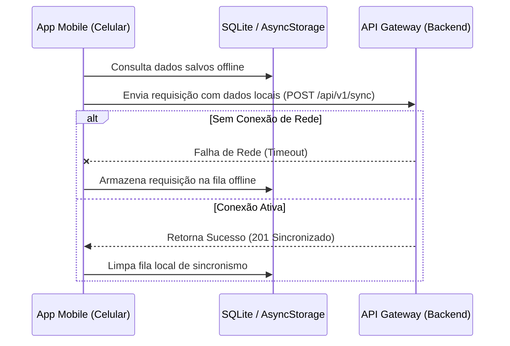

# 📱 Etapa 4: Interface Móvel Integrada (Front-end Móvel)

Este documento serve como diretriz mestre de interface e repositório de evidências para a **Etapa 4: Desenvolvimento do Front-end Móvel**. Ele foi estruturado para orientar o desenvolvimento prático do aplicativo móvel híbrido ou nativo e permitir o acompanhamento e a auto-gestão das atividades pelos alunos.

---

## 🎯 Rubricas de Avaliação desta Etapa

Ao final desta Etapa, cada aluno será avaliado individualmente nestas 6 competências (incluindo oportunidades de desenvolvimento e reavaliação):

1. **H34a-SI-G: Gerenciar e documentar serviços de TI**: Gerenciar e documentar serviços de TI, de forma clara e objetiva (Reavaliação teórica e prática a partir do gerenciamento de serviços no frontend móvel em [src/mobile/](src/mobile/)).
2. **H35b-SI-G: Planejar, desenvolver e gerenciar uma arquitetura de aplicação distribuída**: Desenvolver uma arquitetura de aplicação distribuída (Integração dinâmica do aplicativo móvel com as APIs do backend distribuído desenvolvidas na Etapa 2, medido no código em [src/mobile/](src/mobile/) e na seção [Conectividade e Integração de Dados Móveis](#3-conectividade-e-integracao-de-dados-moveis)).
3. **H35c-SI-G: Planejar, desenvolver e gerenciar uma arquitetura de aplicação distribuída**: Gerenciar uma arquitetura de aplicação distribuída, testando, implantando e avaliando a solução (Processo de modelagem de empacotamento, automação teórica de builds nativos e emulação local, medido na seção [Instruções de Implantação e DevOps Móvel](#5-instrucoes-de-implantacao-e-devops-movel)).
4. **H38a-SI-G: Planejar, desenvolver e gerenciar uma aplicação móvel**: Planejar e documentar uma aplicação móvel, de forma clara e objetiva (Reavaliação/ajustes de planejamento, diagramação e fluxos touch/gestos no mobile, medido em [docs/frontend-mobile.md](docs/frontend-mobile.md)).
5. **H38b-SI-G: Planejar, desenvolver e gerenciar uma aplicação móvel**: Desenvolver uma aplicação móvel (Construção de telas e componentes interativos e uso estruturado de sensores físicos ou recursos locais do smartphone, como Câmera, Geolocalização/GPS, Notificações Push ou Armazenamento offline-first, medido em [src/mobile/](src/mobile/) e na seção [Desenvolvimento de Telas e Sensores Móveis](#2-desenvolvimento-de-telas-e-sensores-moveis)).
6. **H38c-SI-G: Planejar, desenvolver e gerenciar uma aplicação móvel**: Gerenciar uma aplicação móvel, testando, implantando e avaliando a solução (Escrita de suítes de testes unitários móveis, testes de interface móvel ou evidências instrumentadas de emulação bem-sucedida, medido na seção [Estratégia e Relatório de Testes Móveis](#4-estrategia-e-relatorio-de-testes-moveis)).

---

## 📅 QUADRO DE CONTRIBUIÇÃO REAL (ETAPA 4)

**Atenção alunos:** Preencham esta tabela para atualizar o andamento das tarefas e quem foi o responsável técnico pela construção do Front-end Móvel. Os nomes, usuários e links de evidências devem corresponder aos entregáveis em [src/mobile/](src/mobile/).

- **Status admitidos**: `⌛ Não Iniciado` | `📝 Em Progresso` | `✔️ Entregue`
- **Autoria Git**: Indica se há commits desse estudante nos arquivos da tarefa.

**Atividades Semanais desta Etapa** (ver [Cronograma do Semestre](contexto.md#-cronograma-do-semestre-semana--periodo)):
- `ATV4.1` — Desenvolvimento de Funcionalidades - Mobile (Semanas 14 a 16)
- `ATV4.2` — Testes - Front-End Mobile (Semana 17)

| Rubrica Curricular | ID Tarefa | Atividade Semanal | Descrição Detalhada da Tarefa | Estudante Responsável | GitHub Username | Status de Entrega | Evidência/Seção Temática | Autoria Git |
| :---: | :---: | :---: | :--- | :--- | :---: | :---: | :--- | :---: |
| **H38b** | `T4.1` | `ATV4.1` | Configuração Inicial e Estrutura do App (Expo, Flutter CLI, etc.) | [Nome do Aluno 1] | `username1` | `⌛ Não Iniciado` | [Instalação/README](src/mobile/README.md) | [ ] |
| **H38b** | `T4.2` | `ATV4.1` | Desenvolvimento da Navegação Nativa (Tabs, Drawer, Stack) | [Nome do Aluno 2] | `username2` | `⌛ Não Iniciado` | [Seção 2.1](#21-telas-desenvolvidas-e-fluxos-de-gestos) | [ ] |
| **H38b** | `T4.3` | `ATV4.1` | Implementação das Interfaces de Usuário Principais do App | [Nome do Aluno 3] | `username3` | `⌛ Não Iniciado` | [Seção 2.1](#21-telas-desenvolvidas-e-fluxos-de-gestos) | [ ] |
| **H38b** | `T4.4` | `ATV4.1` | Integração com Recursos Físicos (GPS, Câmera, Local Storage) | [Nome do Aluno 4] | `username4` | `⌛ Não Iniciado` | [Seção 2.2](#22-integracao-de-hardware-e-recursos-nativos) | [ ] |
| **H35b** | `T4.5` | `ATV4.1` | Sincronismo Remoto das Rota de APIs no Mobile (Axios, Offline-First)| [Nome do Aluno 5] | `username5` | `⌛ Não Iniciado` | [Seção 3.2](#32-servico-de-integracao-de-rede) | [ ] |
| **H38c** | `T4.6` | `ATV4.2` | Desenvolvimento de Testes Móveis de Componentes ou Usabilidade | [Nome do Aluno 6] | `username6` | `⌛ Não Iniciado` | [Seção 4.1](#41-suite-de-testes-mobile) | [ ] |
| **H35c** | `T4.7` | `ATV4.1` | Proposta de Pipeline de Build Móvel e Provisionamento | [Nome do Aluno 1] | `username1` | `⌛ Não Iniciado` | [Seção 5.1](#51-proposta-de-pipeline-de-build-e-empacotamento-nativo) | [ ] |
| **H38c** | `T4.8` | `ATV4.2` | Roteiro de Emulação e Instruções de Execução Local do App | [Nome do Aluno 5] | `username5` | `⌛ Não Iniciado` | [Seção 5.2](#52-disponibilizacao-de-ambiente-de-teste-e-emulacao-local) | [ ] |

---

# 1. Escopo e Diretrizes da Interface Móvel

[Insira aqui uma breve descrição do escopo técnico do produto móvel que foi entregue. Qual tecnologia de desenvolvimento híbrido ou nativo foi adotada (ex: React Native com Expo, Flutter), como o aplicativo móvel interage com o ecossistema distribuído de APIs e quais foram os pilares de usabilidade focados no contexto touch (gestos, acessibilidade, facilidade de uso com uma mão).]

---

# 2. Desenvolvimento de Telas e Sensores Móveis

*(Esta seção atende diretamente à rubrica **H38b**)*

Abaixo detalhe como as interfaces visuais e os comportamentos nativos físicos foram implementados nos diretórios de código em [src/mobile/](src/mobile/).

## 2.1. Telas Desenvolvidas e Fluxos de Gestos

Descreva as telas desenvolvidas e como o encadeamento de fluxo de gestos foi construído na prática.

*   **Página 1: Login / Autenticação Móvel**: [Explique o funcionamento da tela, indicando os campos de controle e o que ocorre quando há a submissão de dados.]
*   **Página 2: Visualizador Operacional com Mapa / GPS**: ...

*Insira ou anexe Screenshots funcionais do aplicativo rodando em um emulador ou aparelho real:*
```
[Insira aqui fotos/capturas do app móvel para evidência física de telas e transições]
```

## 2.2. Integração de Hardware e Recursos Nativos

[Descreva de forma detalhada de que maneira o aplicativo faz uso ou integra componentes físicos do smartphone. Explique a lógica de códigos para ler dados de: Geolocalização/GPS (como rastreio em tempo real), Câmera/Leitor de código de barras, Armazenamento local leve para modo offline (AsyncStorage, SQLite) ou notificações push.]

---

# 3. Conectividade e Integração de Dados Móveis

*(Esta seção atende diretamente à rubrica **H35b**)*

## 3.1. Arquitetura de Comunicação Síncrona / Assíncrona



## 3.2. Serviço de Integração de Rede

[Descreva como o serviço de chamada à API web trata as oscilações de conectividade de rede características dos dispositivos celulares (re-tentativas automáticas, timeout, ou interceptador de requisições de JWT).]

---

# 4. Estratégia e Relatório de Testes Móveis

*(Esta seção atende diretamente à rubrica **H38c**)*

[Explique a abordagem de testes focados na usabilidade móvel. Se houveram testes automatizados de componentes ou testes dinâmicos de renderização física, detalhe localmente.]

## 4.1. Suíte de Testes Mobile

- **Ferramenta de Teste Utilizada**: (Ex: `Jest`, `React Native Testing Library`, `Maestro`, `Appium`).
- **Comando de Execução**: `npm run test` ou correspondente.

### Tabela de Cobertura de Testes Mobile:

| Tela / Módulo Móvel | Tipo de Teste (Unitário/Instumentado) | Comportamento Validado | Status da Suíte |
| :--- | :--- | :--- | :---: |
| **Sincronizador Offline** | Unitário | Gravação em cache local e leitura com dados mocado | ✔️ Passou |
| **Tela de Login** | Automatizado de Componente | Renderização de inputs na tela e clique do botão | ✔️ Passou |

---

# 5. Instruções de Implantação e DevOps Móvel

*(Esta seção atende diretamente à rubrica **H35c**)*

Abaixo detalhe conceitualmente como o aplicativo móvel é empacotado e disponibilizado para testes locais. **Nota:** Não há cobrança de envio do aplicativo móvel para lojas reais (App Store / Google Play); a avaliação baseia-se na proposta teórica de automação de builds e nas instruções de execução local/emulação.

## 5.1. Proposta de Pipeline de Build e Empacotamento Nativo

[Instruções teóricas de como configurar o empacotamento automatizado do app. Explique como seria planejado o pipeline de automação para gerar artefatos de teste (.apk, .ipa) ou usar canais modernos de nuvem para compilação.]

- **Modelo de Pipeline de Build Móvel**: (Ex: Configuração de build utilizando `Expo Application Services (EAS Build)`, `Fastlane` ou workflows do `GitHub Actions` compilando com Gradle locais/nuvem).

---

## 5.2. Disponibilização de Ambiente de Teste e Emulação Local

- **Canal de Execução de Teste**: (Ex: Como rodar localmente com `Expo Go QR Code` ou gerando builds de desenvolvimento locais).
- **Instruções de Emulação**: Descreva o passo a passo necessário para que um desenvolvedor consiga clonar o projeto a partir de `[src/mobile/](src/mobile/)`, configurar as variáveis de backend no emulador local e testar o app em dispositivos ou emuladores locais (Android Studio / iOS Simulator).

---

# 6. Referências Acadêmicas e de Engenharia

[Registre os livros, manuais ou diretrizes de design móvel utilizados (ex: Material Design da Google ou Human Interface Guidelines da Apple).]

1. **GOOGLE**. *Material Design Guidelines*. Disponível em: <https://m3.material.io/>.
2. **APPLE**. *Human Interface Guidelines*. Disponível em: <https://developer.apple.com/design/human-interface-guidelines/>.
3. [Adicione referências de manuais e documentações oficiais das tecnologias híbridas ou nativas aplicadas].

