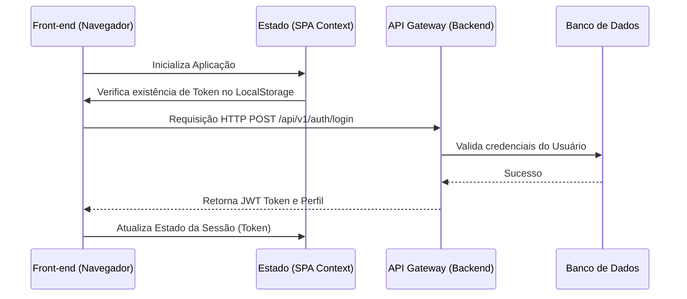

# 💻 Etapa 3: Interface Web Responsiva (Front-end Web)

Este documento serve como diretriz mestre de interface e repositório de evidências para a **Etapa 3: Desenvolvimento do Front-end Web**. Ele foi estruturado para orientar o desenvolvimento prático do cliente web e permitir o acompanhamento e a auto-gestão das atividades pelos alunos.

---

## 🎯 Rubricas de Avaliação desta Etapa

Ao final desta Etapa, cada aluno será avaliado individualmente nestas 6 competências (incluindo oportunidades de desenvolvimento e reavaliação):

1. **H34a-SI-G: Gerenciar e documentar serviços de TI**: Gerenciar e documentar serviços de TI, de forma clara e objetiva (Reavaliação teórica e prática a partir do gerenciamento de serviços no frontend web em [src/frontend/](src/frontend/)).
2. **H35b-SI-G: Planejar, desenvolver e gerenciar uma arquitetura de aplicação distribuída**: Desenvolver uma arquitetura de aplicação distribuída (Integração dinâmica do cliente web com as APIs do backend distribuído desenvolvidas na Etapa 2, medido no código em [src/frontend/](src/frontend/) e na seção [Fluxo de Dados e Integração com Backend](#3-fluxo-de-dados-e-integracao-com-backend)).
3. **H35c-SI-G: Planejar, desenvolver e gerenciar uma arquitetura de aplicação distribuída**: Gerenciar uma arquitetura de aplicação distribuída, testando, implantando e avaliando a solução (Processo de empacotamento, otimização de build estático e elaboração da proposta de deploy automatizado do front-end Web, medido na seção [Instruções de Implantação e DevOps Web](#5-instrucoes-de-implantacao-e-devops-web)).
4. **H37a-SI-G: Planejar, desenvolver e gerenciar uma aplicação Web**: Planejar e documentar uma aplicação Web, de forma clara e objetiva (Reavaliação/ajustes de planejamento, diagramação e design, medido em [docs/frontend-web.md](docs/frontend-web.md)).
5. **H37b-SI-G: Planejar, desenvolver e gerenciar uma aplicação Web**: Desenvolver uma aplicação Web (Construção de telas e componentes funcionais baseados no layout responsivo planejado, consumo de dados assíncronos e controle de estados locais, medido em [src/frontend/](src/frontend/) e na seção [Desenvolvimento de Páginas e Componentes](#2-desenvolvimento-de-paginas-e-componentes)).
6. **H37c-SI-G: Planejar, desenvolver e gerenciar uma aplicação Web**: Gerenciar uma aplicação Web, testando, implantando e avaliando a solução (Escrita de suítes de testes automatizados unitários de componentes ou de interface de ponta a ponta, e auditoria de qualidade/performance no ecossistema web, medido na seção [Estratégia e Relatório de Testes Web](#4-estrategia-e-relatorio-de-testes-web)).

---

## 📅 QUADRO DE CONTRIBUIÇÃO REAL (ETAPA 3)

**Atenção alunos:** Preencham esta tabela para atualizar o andamento das tarefas e quem foi o responsável técnico pela construção do Front-end Web. Os nomes, usuários e links de evidências devem corresponder aos entregáveis em [src/frontend/](src/frontend/).

- **Status admitidos**: `⌛ Não Iniciado` | `📝 Em Progresso` | `✔️ Entregue`
- **Autoria Git**: Indica se há commits desse estudante nos arquivos da tarefa.

**Atividades Semanais desta Etapa** (ver [Cronograma do Semestre](contexto.md#-cronograma-do-semestre-semana--periodo)):
- `ATV3.1` — Desenvolvimento de Funcionalidades - Web (Semanas 10 a 12)
- `ATV3.2` — Testes - Front-End Web (Semana 13)

| Rubrica Curricular | ID Tarefa | Atividade Semanal | Descrição Detalhada da Tarefa | Estudante Responsável | GitHub Username | Status de Entrega | Evidência/Seção Temática | Autoria Git |
| :---: | :---: | :---: | :--- | :--- | :---: | :---: | :--- | :---: |
| **H37b** | `T3.1` | `ATV3.1` | Configuração do Projeto Web (Create React App, Vite, etc.) | [Nome do Aluno 1] | `username1` | `⌛ Não Iniciado` | [Instalação/README](src/frontend/README.md) | [ ] |
| **H37b** | `T3.2` | `ATV3.1` | Estilização Global, Layout Base Responsivo e Temas (CSS) | [Nome do Aluno 2] | `username2` | `⌛ Não Iniciado` | [Seção 1.2](#12-estilizacao-e-design-sistema) | [ ] |
| **H37b** | `T3.3` | `ATV3.1` | Desenvolvimento das Telas Chaves (Home, Cadastro, Dashboards) | [Nome do Aluno 3] | `username3` | `⌛ Não Iniciado` | [Seção 2.1](#21-telas-implementadas) | [ ] |
| **H35b** | `T3.4` | `ATV3.1` | Consumo Assíncrono da API backend (Services HTTP / Axios) | [Nome do Aluno 4] | `username4` | `⌛ Não Iniciado` | [Seção 3.2](#32-servicos-de-chamada-a-api) | [ ] |
| **H37b** | `T3.5` | `ATV3.1` | Gerenciamento de Estado Global do Cliente (Auth, Rotas Privadas) | [Nome do Aluno 5] | `username5` | `⌛ Não Iniciado` | [Seção 2.2](#22-rotas-e-estado-de-autenticacao) | [ ] |
| **H37c** | `T3.6` | `ATV3.2` | Desenvolvimento de Testes Modernos (Jest / Testing Library / Cypress) | [Nome do Aluno 6] | `username6` | `⌛ Não Iniciado` | [Seção 4.1](#41-arquivos-de-testes) | [ ] |
| **H35c** | `T3.7` | `ATV3.1` | Configuração de Build, Otimização (Assets, Caching) e Docker | [Nome do Aluno 1] | `username1` | `⌛ Não Iniciado` | [Seção 5.1](#51-conteinerisacao-da-aplicacao-web) | [ ] |
| **H37c** | `T3.8` | `ATV3.2` | Proposta de Implantação e Pipeline de CI/CD Web | [Nome do Aluno 5] | `username5` | `⌛ Não Iniciado` | [Seção 5.2](#52-proposta-de-infraestrutura-de-deploy-e-automacao-de-builds) | [ ] |

---

# 1. Escopo e Diretrizes da Interface Web

[Insira aqui uma breve introdução descrevendo o escopo técnico do produto Web que foi entregue. Qual framework visual principal foi adotado (ex: React com Vite, Angular, Vue), como a interface se conecta na topologia da sua rede distribuída e como as premissas de UX/UI foram priorizadas.]

## 1.1. Identidade Visual da Interface Web

[Justifique as escolhas visuais do design em conformidade com o que foi planejado na Etapa 1. Descreva brevemente a paleta de cores (ex: Primary `#1B2A47`, Secondary `#E2E8F0`), a tipografia (ex: `Inter, sans-serif`) e a biblioteca de componentes visuais adotada se houver (ex: TailwindCSS, ChakraUI, Bootstrap).]

---

# 2. Desenvolvimento de Páginas e Componentes

*(Esta seção atende diretamente à rubrica **H37b**)*

Abaixo detalhe como as interfaces visuais foram implementadas nos diretórios de código em [src/frontend/](src/frontend/).

## 2.1. Telas Implementadas

Descreva as telas desenvolvidas e como elas interagem com os fluxos operacionais planejados.

*   **Página 1: Login / Cadastro Administrativo**: [Explique o funcionamento da tela, indicando os campos de controle e o que ocorre quando há a submissão de dados.]
*   **Página 2: Dashboard de Soluções**: ...

*Insira ou anexe Screenshots funcionais do sistema rodando:*
```
[Insira aqui imagens das telas navegáveis na Web para evidência física]
```

## 2.2. Rotas e Estado de Autenticação

[Descreva como o aplicativo lida com autenticação. Explique se há um contexto de autenticação global para guardar o JWT gerado no backend, como o guardião de rotas (Route Guards) protege as páginas privadas de usuários sem login e como os dados são retidos no navegador (ex: localStorage, sessionStorage).]

---

# 3. Fluxo de Dados e Integração com Backend

*(Esta seção atende diretamente à rubrica **H35b**)*

## 3.1. Arquitetura de Comunicação Cliente-Servidor



## 3.2. Serviços de Chamada à API

[Cole ou indique o trecho de código ou arquivo de configuração onde as requisições assíncronas são configuradas de forma centralizada (ex: `api.ts` usando Axios com suas URLs base de endpoints e injetando cabeçalhos de autenticação).]

---

# 4. Estratégia e Relatório de Testes Web

*(Esta seção atende diretamente à rubrica **H37c**)*

[Descreva como a qualidade da interface e a resiliência a bugs foram validadas no projeto Web. Indique que ferramentas foram aplicadas para rodar os testes localmente.]

## 4.1. Arquivos de Testes

- **Ferramenta de Asserção de Interface**: (Ex: `Jest`, `React Testing Library`, `Cypress`, `Playwright`).
- **Comando de Execução**: `npm run test` ou `npm run cypress:run`.

### Tabela de Cobertura de Testes Web:

| Componente Web | Tipo de Teste (Unitário/E2E) | Cenário de Teste Validado | Status da Suíte |
| :--- | :--- | :--- | :---: |
| **Formulário de Entrada** | Unitário | Validação de preenchimento, e-mail inválido, botão desabilitado | ✔️ Passou |
| **Integração de Compra** | E2E | Fluxo completo desde seleção de item, autenticação até sucesso | ✔️ Passou |

---

# 5. Instruções de Implantação e DevOps Web

*(Esta seção atende diretamente à rubrica **H35c**)*

## 5.1. Conteinerização da Aplicação Web

[Descreva se o projeto conta com dockerização para servir a interface Web. Por exemplo, uso de imagens multi-stage contendo a etapa de geração de build node e a etapa final rodando um proxy reverso estático como o Nginx para melhor performance.]

- **Caminho do Dockerfile do Frontend Web**: `[src/frontend/Dockerfile](src/frontend/Dockerfile)`

---

## 5.2. Proposta de Infraestrutura de Deploy e Automação de Builds

Abaixo, apresente a proposta teórica de como o build de produção seria gerido e publicado. **Nota:** Não há cobrança de deploy prático na nuvem para esta disciplina; a avaliação consiste na demonstração teórica do plano de implantação/hospedagem e nos testes de interface executados localmente.

- **Serviço de Hospedagem Planejado**: (Ex: `Vercel`, `Netlify`, `GitHub Pages`).
- **Proposta de Fluxo Contínuo**: Explique como o build estático de produção seria planejado de forma automatizada no repositório (ex: GitHub Actions disparando build/teste a cada push).
- **Tratamento de Variáveis e Integração**: Descreva de forma textual como o frontend web se comunicaria com as URLs de variáveis de ambiente secretas em produção para apontar para as APIs distribuídas sem hardcode.

---

# 6. Referências Acadêmicas e de Engenharia

[Registre as fontes técnicas, documentação de frameworks (React, Angular) ou livros sobre usabilidade que inspiraram a solução.]

1. **NIELSEN, Jakob**. *Projetando Websites*: Usabilidade Desenvolvido por Jakob Nielsen. Rio de Janeiro: Campus, 2000.
2. **KRUG, Steve**. *Não me faça pensar*: Uma abordagem de bom senso à usabilidade na Web. Rio de Janeiro: Alta Books, 2014.
3. [Adicione referências de documentação oficial de frameworks e CSS utilizados].

