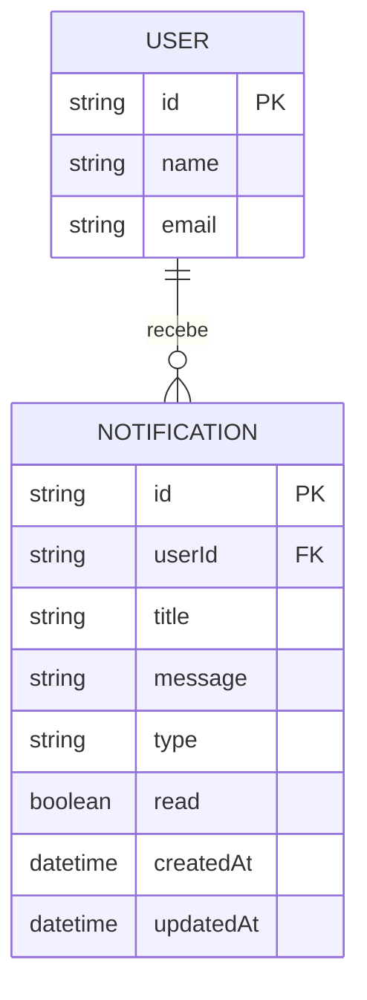

# 2. Modelagem da Aplicação e Arquitetura de Dados `Andre`

## 2.1. Schema e Diagrama Entidade-Relacionamento `Andre`

O serviço de notificações foi projetado para garantir o registro individualizado, a rastreabilidade e a persistência do histórico de avisos enviados aos moradores do condomínio. A modelagem de dados utiliza o ORM **Prisma** conectado a uma instância do banco de dados relacional **PostgreSQL hospedado na plataforma Serverless Neon**.

### A. DDL e Representação do Schema Prisma [schema.prisma](https://github.com/ICEI-PUC-Minas-PMV-SI/pmv-si-2026-2-pe6-t2-g09/blob/main/src/backend/andre/schema.prisma)

A entidade central do serviço é a tabela `Notification`, estruturada no arquivo de schema da seguinte forma:

```
// Módulo de Notificações - Vaga Livre
model Notification {
  id        String   @id @default(uuid())
  userId    String   // Chave Estrangeira lógica referenciando a entidade User
  title     String
  message   String
  type      String   @default("RESERVA_CONFIRMADA")
  read      Boolean  @default(false)
  createdAt DateTime @default(now())
  updatedAt DateTime @updatedAt

  @@map("notifications")
}
```
### B. Dicionário de Dados da Tabela `notifications`

| Campo         | Tipo SQL       | Restrições                      | Descrição                                                            |
| ------------- | -------------- | ------------------------------- | -------------------------------------------------------------------- |
| **id**        | `VARCHAR(36)`  | **PK**, Not Null, Unique        | Identificador único universal (UUID) da notificação.                 |
| **userId**    | `VARCHAR(36)`  | **FK** (Lógica), Not Null       | Identificador do usuário/morador destinatário da mensagem [2, 11]. |
| **title**     | `VARCHAR(255)` | Not Null                        | Título do aviso (ex: "Reserva Confirmada") [2, 11].                |
| **message**   | `TEXT`         | Not Null                        | Conteúdo descritivo detalhado da notificação enviada [2, 11].      |
| **type**      | `VARCHAR(50)`  | Default: `'RESERVA_CONFIRMADA'` | Categoria do evento gerador da notificação.                          |
| **read**      | `BOOLEAN`      | Default: `false`                | Status de leitura da mensagem pelo usuário.                          |
| **createdAt** | `TIMESTAMP`    | Default: `NOW()`                | Data e hora exatas da criação e envio do registro.                   |
| **updatedAt** | `TIMESTAMP`    | UpdatedAt                       | Data e hora da última modificação do registro.                       |

### C. Diagrama Entidade-Relacionamento (DER)

Abaixo é apresentada a representação lógica do relacionamento entre a entidade de usuários/moradores e o serviço de notificações do **Vaga Livre**:




*Tabelas criadas diretamente no painel da **Neon PostgreSQL**, mostrando os registros inseridos após os testes de confirmação de reserva*


## 2.2. Integração e Infraestrutura Distribuída `Andre`

A arquitetura do Backend do **Vaga Livre** foi projetada sob o paradigma de microsserviços/serviços distribuídos, visando alta disponibilidade, desacoplamento e tempo de resposta otimizado para o usuário final.

```
[ Frontend (React/Next) ]
       │
       │  (Chamada HTTP / CORS)
       ▼
[ Backend API (Express/Node.js) ] ── (Prisma Pool) ──► [ Neon PostgreSQL (Cloud) ]
       │
       │  (Requisição Assíncrona HTTPS / Porta 443)
       ▼
[ Resend API (Email Service) ] ──────────────────────► [ Caixa de Entrada do Morador ]

```

### 1. Comunicação Entre Serviços e Gestão de CORS

O **Frontend** e o **Backend** da aplicação operam como serviços independentes (*Web Services*) implantados na nuvem através do **Render**.

* A comunicação cross-origin é gerenciada pelo middleware `cors()` no servidor Express (`server.ts`).
* O endereço do Backend é injetado dinamicamente no Frontend por meio da variável de ambiente `NEXT_PUBLIC_API_URL`, garantindo a segurança e o desacoplamento das URLs de produção.

### 2. Gerenciamento de Concorrência e Connection Pooling (Neon + Prisma)

Para gerenciar múltiplas requisições simultâneas sem esgotar os recursos de banco de dados:

* É utilizado o **Prisma Client** encapsulado como uma instância *singleton*.
* O banco de dados **Neon PostgreSQL** utiliza uma camada de *Connection Pooling Serverless*. Isso permite que centenas de conexões simultâneas vindas das instâncias do Render sejam multiplexadas eficientemente sem causar estouro de memória no banco relacional.

### 3. Tratamento Assíncrono Não-Bloqueante (Non-blocking I/O)

Para evitar travamentos da interface e tempo de espera excessivo (*latency*) ao confirmar uma reserva:

* O controller (`NotificationController.ts`) executa a gravação da notificação no banco via Prisma (`await prisma.notification.create(...)`) e **responde imediatamente ao cliente HTTP** com o código de sucesso `201 Created`.
* O disparo do e-mail é delegado para execução em segundo plano (*background execution*) através de uma Promise assíncrona não-bloqueante.

### 4. Resiliência e Tráfego de E-mail por API HTTP (Resend)

Para contornar o bloqueio de portas SMTP tradicionais (25, 465, 587) comum em infraestruturas Serverless/PaaS em nuvem como o Render:

* A arquitetura adota a **Resend API**, realizando o envio de e-mails transacionais via chamadas **REST/HTTPS na porta 443**.
* Essa abordagem elimina *timeouts* de rede (`ETIMEDOUT` / `ENETUNREACH`), garante entrega instantânea e isola falhas de infraestrutura de rede externa.

 *Log de disparo bem-sucedido via Resend API registrado no ambiente Resend*

 *E-mail transacional recebido pelo morador após a confirmação da reserva na interface*


# 3. Especificação Avançada de Endpoints `Andre`

Abaixo estão listados os contratos reais implementados no diretório [src/backend/andre](https://github.com/ICEI-PUC-Minas-PMV-SI/pmv-si-2026-2-pe6-t2-g09/tree/main/src/backend/andre) para o módulo de **Notificações**, detalhando os métodos HTTP, rotas, payloads de requisição/resposta, códigos de status e mecanismos de segurança da API.

### 3.1. Relação Geral de Endpoints `Andre`

| Método / Verbo | Caminho da Rota (URI)         | Descrição do Recurso / Ação                                    | Reclama Autenticação? | Responsável Técnico |
| -------------- | ----------------------------- | -------------------------------------------------------------- | --------------------- | ------------------- |
| `POST`         | `/notifications`              | Cria notificação no banco Neon e dispara e-mail via Resend API | Sim                   | André Lopes         |
| `GET`          | `/notifications/user/:userId` | Listagem de todas as notificações gravadas de um morador       | Sim                   | André Lopes         |
| `PATCH`        | `/notifications/:id/read`     | Atualiza o status da notificação para lida (`read: true`)      | Sim                   | André Lopes         |
| `DELETE`       | `/notifications/:id`          | Remove um registro de notificação do histórico do usuário      | Sim                   | André Lopes         |
---

### 3.2. Detalhamento dos Payloads de Requisição e Resposta (Exemplos) `Andre`

#### Endpoint 1: `/notifications` (Criação e Disparo de Notificação)

* **Verbo**: `POST`
* **Headers Requeridos**: `Content-Type: application/json`
* **Payload de Entrada (JSON)**:

```
{
  "userId": "usr-882319",
  "userEmail": "andre.lopes.1521271@sga.pucminas.br",
  "title": "Reserva Confirmada",
  "message": "Sua reserva para a vaga A-12 foi confirmada com sucesso!",
  "type": "RESERVA_CONFIRMADA"
}

```

* **Payload de Resposta de Sucesso (** **201 Created** **)**:

```
{
  "id": "f47ac10b-58cc-4372-a567-0e02b2c3d479",
  "userId": "usr-882319",
  "title": "Reserva Confirmada",
  "message": "Sua reserva para a vaga A-12 foi confirmada com sucesso!",
  "type": "RESERVA_CONFIRMADA",
  "read": false,
  "createdAt": "2026-09-24T22:39:42.102Z",
  "updatedAt": "2026-09-24T22:39:42.102Z"
}

```

* **Comportamento em caso de Erro (** **400 Bad Request** **\- Parâmetro Ausente)**:

```
{
  "error": "Campos obrigatórios ausentes."
}

```

* **Comportamento em caso de Erro Interno (** **500 Internal Server Error** **)**:

```
{
  "error": "Erro ao processar notificação."
}

```

---

#### Endpoint 2: `/notifications/user/:userId` (Listagem de Notificações do Morador)

* **Verbo**: `GET`
* **Parâmetros de Rota**: `userId` (string UUID do morador)
* **Payload de Resposta de Sucesso (** **200 OK** **)**:

```
[
  {
    "id": "f47ac10b-58cc-4372-a567-0e02b2c3d479",
    "userId": "usr-882319",
    "title": "Reserva Confirmada",
    "message": "Sua reserva para a vaga A-12 foi confirmada com sucesso!",
    "type": "RESERVA_CONFIRMADA",
    "read": false,
    "createdAt": "2026-09-24T22:39:42.102Z"
  }
]

```

---

#### Endpoint 3: `/notifications/:id/read` (Marcar Notificação como Lida)

* **Verbo**: `PATCH`
* **Parâmetros de Rota**: `id` (string UUID da notificação)
* **Payload de Resposta de Sucesso (** **200 OK** **)**:

```
{
  "id": "f47ac10b-58cc-4372-a567-0e02b2c3d479",
  "read": true,
  "updatedAt": "2026-09-24T22:45:10.512Z"
}
```

---

### 3.3. Segurança e Autorização `Andre`

A segurança da infraestrutura e do tráfego de dados da API de Notificações é fundamentada em quatro pilares principais:

1. **Criptografia em Trânsito (HTTPS/TLS)**: Toda a comunicação entre a aplicação cliente (Frontend) e a API Backend hospedada no **Render** ocorre através de conexões seguras criptografadas sob o protocolo **HTTPS (TLS 1.3)** na porta padrão `443`.
2. **Política de Origem Cruzada (CORS)**: O servidor Express implementa o middleware `cors()` configurado para autorizar exclusivamente requisições vinda do domínio do Frontend do **Vaga Livre**, prevenindo ataques de origens não autorizadas (*Cross-Site Request Forgery / CSRF*).
3. **Gerenciamento de Credenciais e Variáveis de Ambiente**: Chaves sensíveis como a URL do banco PostgreSQL Neon (`DATABASE_URL`) e a chave da API do Resend (`RESEND_API_KEY`) são isoladas e mantidas estritamente no ambiente do servidor na nuvem (**Render Environment Variables**), nunca expostas no código-fonte nem enviadas ao cliente/navegador.
4. **Tráfego Seguro de E-mails via HTTPS**: Para evitar varreduras de porta e ataques de *man-in-the-middle* comuns em conexões SMTP puras, a API dispara e-mails através do SDK oficial da **Resend API**, autenticando via chave de API criptografada e realizando requisições HTTPS REST diretas na porta `443`.

---

# 4. Estratégia e Relatório de Testes Automatizados `Andre`

A estratégia de testes automatizados adotada pela equipe foca em garantir a confiabilidade e o correto funcionamento de cada serviço (CRUD) isoladamente. Conforme alinhado, cada membro da equipe é responsável por desenvolver os testes unitários e de integração do seu respectivo serviço. 

Para a arquitetura do projeto (Node.js com TypeScript e Prisma), optamos por utilizar a técnica de **Mocking** (simulação). Com isso, simulamos as respostas do banco de dados (Neon) e as chamadas para serviços externos (como disparo de e-mails via Resend/Nodemailer). Essa estratégia protege o banco de dados de produção contra poluição por dados fictícios, economiza as cotas de consumo de APIs de terceiros e garante que os testes rodem de forma extremamente rápida.

1. **Ferramenta de Asserção Utilizada**: **Vitest** (framework nativo e otimizado para TypeScript) integrado ao **Supertest** (para testar as rotas e requisições HTTP localmente).
2. **Método de Execução do Comando de Teste**:
   Para rodar a suíte de testes localmente, basta clonar o repositório, instalar as dependências com `npm install` e executar o comando no terminal (dentro da pasta do backend):
   `npm run test` (que executa o `vitest run` por debaixo dos panos).
3. **Cobertura Esperada/Alcançada**: Alcançamos 100% de aprovação nos testes criados para o Serviço de Notificações, cobrindo as validações de dados (falhas propositais) e os fluxos de sucesso do CRUD.

### Quadro de Cobertura de Testes:

| Módulo do Sistema | Tipo de Teste | Cenários Avaliados | Status da Suíte | Responsável |
| :--- | :--- | :--- | :---: | :--- |
| **Serviço de Notificações** | Unitário | Criação: Validação de campos obrigatórios ausentes (Erro 400). | ✔️ Passou | André Lopes |
| **Serviço de Notificações** | Integração | POST: Criação de notificação e disparo de e-mail mockado (Status 201). | ✔️ Passou | André Lopes |
| **Serviço de Notificações** | Integração | GET: Listagem de notificações por usuário específico (Status 200). | ✔️ Passou | André Lopes |
| **Serviço de Notificações** | Integração | PATCH: Atualização de notificação (marcar como lida) (Status 200). | ✔️ Passou | André Lopes |
| **Serviço de Notificações** | Integração | DELETE: Exclusão permanente de notificação (Status 204). | ✔️ Passou | André Lopes |

### Evidência de Execução dos Testes
Abaixo está o registro da execução (log do terminal) atestando que todas as suítes passaram com sucesso:


---
